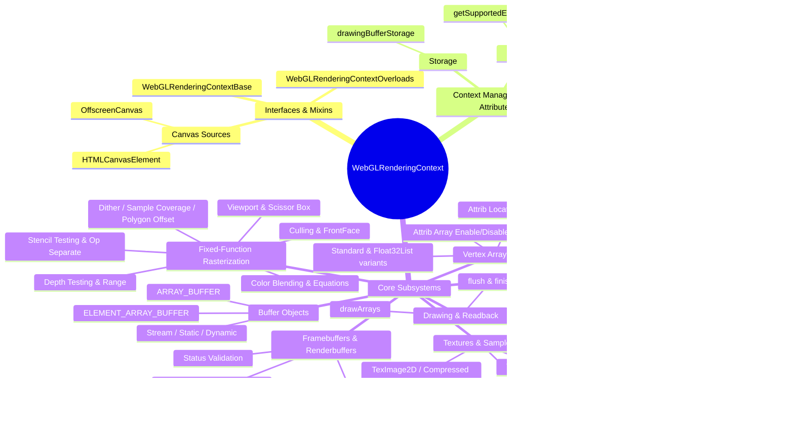
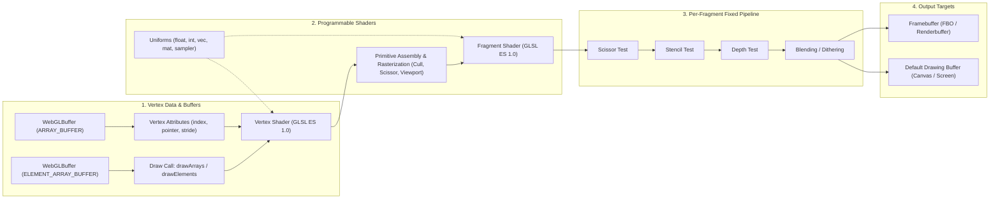
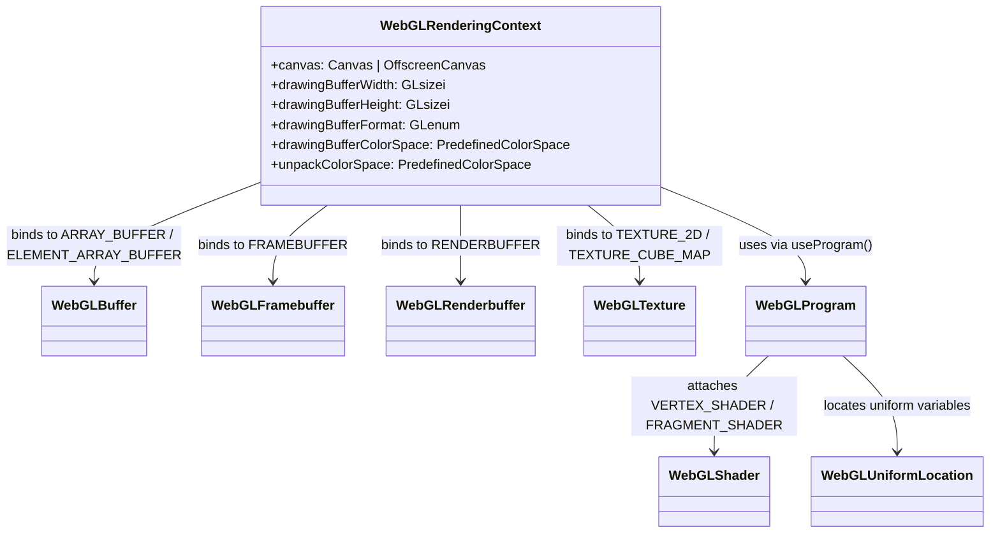

# WebGL Rendering Context Specification & Architecture Reference

> **Standard**: WebGL 1.0 / OpenGL ES 2.0 Web IDL Specification Interface  
> **Exposed**: `[Exposed=(Window,Worker)]`

---

## Table of Contents

1. [Architectural Overview & Mind Maps](#1-architectural-overview--mind-maps)
   - [High-Level Mind Map](#11-high-level-mind-map)
   - [WebGL State Machine & Pipeline Flow](#12-webgl-state-machine--pipeline-flow)
   - [Object Hierarchy & Bindings](#13-object-hierarchy--bindings)
2. [Interface Declarations & Typedefs](#2-interface-declarations--typedefs)
   - [Typedefs](#21-typedefs)
   - [Interface Hierarchy & Mixins](#22-interface-hierarchy--mixins)
   - [Context Attributes & Lifecycle Properties](#23-context-attributes--lifecycle-properties)
3. [Exhaustive Enum Reference (Categorized & Tabulated)](#3-exhaustive-enum-reference-categorized--tabulated)
   - [3.1 ClearBufferMask](#31-clearbuffermask)
   - [3.2 BeginMode (Primitive Topologies)](#32-beginmode-primitive-topologies)
   - [3.3 AlphaFunction (Legacy / Not supported in ES20)](#33-alphafunction-legacy--not-supported-in-es20)
   - [3.4 Blending Factors & Equations](#34-blending-factors--equations)
   - [3.5 Buffer Objects & Usage Patterns](#35-buffer-objects--usage-patterns)
   - [3.6 Cull Face & Front Face Modes](#36-cull-face--front-face-modes)
   - [3.7 Depth & Stencil Comparison Functions](#37-depth--stencil-comparison-functions)
   - [3.8 Stencil Operations & Back Stencil State](#38-stencil-operations--back-stencil-state)
   - [3.9 Enable Capabilities (EnableCap)](#39-enable-capabilities-enablecap)
   - [3.10 Error Codes](#310-error-codes)
   - [3.11 Parameter Queries (GetPName)](#311-parameter-queries-getpname)
   - [3.12 Hints (HintTarget & HintMode)](#312-hints-hinttarget--hintmode)
   - [3.13 Data Types (DataType)](#313-data-types-datatype)
   - [3.14 Pixel Formats & Pixel Types](#314-pixel-formats--pixel-types)
   - [3.15 Shaders, Programs & Precision Types](#315-shaders-programs--precision-types)
   - [3.16 Uniform Types](#316-uniform-types)
   - [3.17 Vertex Attributes](#317-vertex-attributes)
   - [3.18 Textures (Targets, Units, Filters, Wrap Modes & Parameters)](#318-textures-targets-units-filters-wrap-modes--parameters)
   - [3.19 Framebuffers & Renderbuffers](#319-framebuffers--renderbuffers)
   - [3.20 Read Format Queries](#320-read-format-queries)
   - [3.21 Implementation Strings (StringName)](#321-implementation-strings-stringname)
   - [3.22 WebGL-Specific Constants](#322-webgl-specific-constants)
4. [Exhaustive Function Reference](#4-exhaustive-function-reference)
   - [4.1 Context Lifecycle, Capabilities & Extensions](#41-context-lifecycle-capabilities--extensions)
   - [4.2 Frame Clearing & Viewport / Scissor Rectangles](#42-frame-clearing--viewport--scissor-rectangles)
   - [4.3 Rasterizer State & Depth / Stencil / Color Masking](#43-rasterizer-state--depth--stencil--color-masking)
   - [4.4 Blending Configuration](#44-blending-configuration)
   - [4.5 Buffer Management & Data Upload](#45-buffer-management--data-upload)
   - [4.6 Shaders & Programs Pipeline](#46-shaders--programs-pipeline)
   - [4.7 Vertex Attributes & Pointers](#47-vertex-attributes--pointers)
   - [4.8 Uniform State (Scalars, Vectors, Matrices)](#48-uniform-state-scalars-vectors-matrices)
   - [4.9 Textures & Samplers Management](#49-textures--samplers-management)
   - [4.10 Framebuffer & Renderbuffer Subsystem](#410-framebuffer--renderbuffer-subsystem)
   - [4.11 Drawing Primitives & Execution Control](#411-drawing-primitives--execution-control)
   - [4.12 Pixel Readback & Storage Modes](#412-pixel-readback--storage-modes)

---

## 1. Architectural Overview & Mind Maps

### 1.1 High-Level Mind Map



### 1.1.1 Subsystem Navigation Map

Jump to any subsystem, function, or enum section across the documentation:

- 🌐 **[Context Management & Lifecycle](#41-context-lifecycle-capabilities--extensions)**
  - Lifecycle & Status: [`isContextLost()`](#fn-iscontextlost) | [`getContextAttributes()`](#fn-getcontextattributes) | [`drawingBufferStorage()`](#fn-drawingbufferstorage)
  - Extensions: [`getExtension()`](#fn-getextension) | [`getSupportedExtensions()`](#fn-getsupportedextensions)
  - Context Attributes: [`canvas`](#attr-canvas) | [`drawingBufferWidth`](#attr-drawingbufferwidth) | [`drawingBufferHeight`](#attr-drawingbufferheight) | [`drawingBufferFormat`](#attr-drawingbufferformat) | [`drawingBufferColorSpace`](#attr-drawingbuffercolorspace) | [`unpackColorSpace`](#attr-unpackcolorspace)
  - Error & Query: [`getError()`](#fn-geterror) | [`getParameter()`](#fn-getparameter) | [`hint()`](#fn-hint)
  - Capabilities: [`enable()`](#fn-enable) | [`disable()`](#fn-disable) | [`isEnabled()`](#fn-isenabled)
- 📦 **[Buffer Objects & Vertex Geometry](#45-buffer-management--data-upload)**
  - Targets: [`ARRAY_BUFFER`](#enum-array_buffer) | [`ELEMENT_ARRAY_BUFFER`](#enum-element_array_buffer)
  - Usage Hints: [`STATIC_DRAW`](#enum-static_draw) | [`DYNAMIC_DRAW`](#enum-dynamic_draw) | [`STREAM_DRAW`](#enum-stream_draw)
  - Management: [`createBuffer()`](#fn-createbuffer) | [`bindBuffer()`](#fn-bindbuffer) | [`bufferData()`](#fn-bufferdata) | [`bufferSubData()`](#fn-buffersubdata) | [`deleteBuffer()`](#fn-deletebuffer) | [`isBuffer()`](#fn-isbuffer) | [`getBufferParameter()`](#fn-getbufferparameter)
  - Attributes: [`vertexAttribPointer()`](#fn-vertexattribpointer) | [`enableVertexAttribArray()`](#fn-enablevertexattribarray) | [`disableVertexAttribArray()`](#fn-disablevertexattribarray) | [`bindAttribLocation()`](#fn-bindattriblocation) | [`getAttribLocation()`](#fn-getattriblocation) | [`getActiveAttrib()`](#fn-getactiveattrib) | [`getVertexAttrib()`](#fn-getvertexattrib) | [`getVertexAttribOffset()`](#fn-getvertexattriboffset)
  - Generic Values: [`vertexAttrib1f`](#fn-vertexattrib1f) .. [`4f`](#fn-vertexattrib4f) | [`vertexAttrib1fv`](#fn-vertexattrib1fv) .. [`4fv`](#fn-vertexattrib4fv)
- 🔮 **[Shaders & GPU Programs](#46-shaders--programs-pipeline)**
  - Stages: [`VERTEX_SHADER`](#enum-vertex_shader) | [`FRAGMENT_SHADER`](#enum-fragment_shader)
  - Shader Lifecycle: [`createShader()`](#fn-createshader) | [`shaderSource()`](#fn-shadersource) | [`compileShader()`](#fn-compileshader) | [`getShaderParameter()`](#fn-getshaderparameter) | [`getShaderInfoLog()`](#fn-getshaderinfolog) | [`getShaderSource()`](#fn-getshadersource) | [`getShaderPrecisionFormat()`](#fn-getshaderprecisionformat) | [`deleteShader()`](#fn-deleteshader) | [`isShader()`](#fn-isshader)
  - Program Lifecycle: [`createProgram()`](#fn-createprogram) | [`attachShader()`](#fn-attachshader) | [`detachShader()`](#fn-detachshader) | [`linkProgram()`](#fn-linkprogram) | [`useProgram()`](#fn-useprogram) | [`validateProgram()`](#fn-validateprogram) | [`getProgramParameter()`](#fn-getprogramparameter) | [`getProgramInfoLog()`](#fn-getprograminfolog) | [`getAttachedShaders()`](#fn-getattachedshaders) | [`deleteProgram()`](#fn-deleteprogram) | [`isProgram()`](#fn-isprogram)
  - Uniforms: [`getUniformLocation()`](#fn-getuniformlocation) | [`getActiveUniform()`](#fn-getactiveuniform) | [`getUniform()`](#fn-getuniform) | [`uniform1f`](#fn-uniform1f) .. [`4f`](#fn-uniform4f) | [`uniform1i`](#fn-uniform1i) .. [`4i`](#fn-uniform4i) | [`uniform1fv`](#fn-uniform1fv) .. [`4fv`](#fn-uniform4fv) | [`uniform1iv`](#fn-uniform1iv) .. [`4iv`](#fn-uniform4iv) | [`uniformMatrix2fv`](#fn-uniformmatrix2fv) .. [`4fv`](#fn-uniformmatrix4fv)
- 🖼️ **[Textures & Samplers](#49-textures--samplers-management)**
  - Targets: [`TEXTURE_2D`](#enum-texture_2d) | [`TEXTURE_CUBE_MAP`](#enum-texture_cube_map) ([+X](#enum-texture_cube_map_positive_x), [-X](#enum-texture_cube_map_negative_x), [+Y](#enum-texture_cube_map_positive_y), [-Y](#enum-texture_cube_map_negative_y), [+Z](#enum-texture_cube_map_positive_z), [-Z](#enum-texture_cube_map_negative_z))
  - Units: [`activeTexture()`](#fn-activetexture) with [`TEXTURE0`](#enum-texture0) .. [`TEXTURE31`](#enum-texture31)
  - Upload: [`texImage2D()`](#fn-teximage2d) | [`texSubImage2D()`](#fn-texsubimage2d) | [`copyTexImage2D()`](#fn-copyteximage2d) | [`copyTexSubImage2D()`](#fn-copytexsubimage2d) | [`compressedTexImage2D()`](#fn-compressedteximage2d) | [`compressedTexSubImage2D()`](#fn-compressedtexsubimage2d)
  - Filters & Wrap: [`texParameteri()`](#fn-texparameteri) | [`texParameterf()`](#fn-texparameterf) | [`getTexParameter()`](#fn-gettexparameter) | [`generateMipmap()`](#fn-generatemipmap) | [`pixelStorei()`](#fn-pixelstorei)
  - Lifecycle: [`createTexture()`](#fn-createtexture) | [`bindTexture()`](#fn-bindtexture) | [`deleteTexture()`](#fn-deletetexture) | [`isTexture()`](#fn-istexture)
- 📐 **[Rasterization & Fixed-Function State](#43-rasterizer-state--depth--stencil--color-masking)**
  - Geometry: [`viewport()`](#fn-viewport) | [`scissor()`](#fn-scissor) | [`cullFace()`](#fn-cullface) | [`frontFace()`](#fn-frontface) | [`lineWidth()`](#fn-linewidth) | [`polygonOffset()`](#fn-polygonoffset)
  - Clearing: [`clear()`](#fn-clear) | [`clearColor()`](#fn-clearcolor) | [`clearDepth()`](#fn-cleardepth) | [`clearStencil()`](#fn-clearstencil)
  - Testing & Masks: [`depthFunc()`](#fn-depthfunc) | [`depthRange()`](#fn-depthrange) | [`depthMask()`](#fn-depthmask) | [`colorMask()`](#fn-colormask) | [`stencilFunc()`](#fn-stencilfunc) | [`stencilFuncSeparate()`](#fn-stencilfuncseparate) | [`stencilMask()`](#fn-stencilmask) | [`stencilMaskSeparate()`](#fn-stencilmaskseparate) | [`stencilOp()`](#fn-stencilop) | [`stencilOpSeparate()`](#fn-stencilopseparate) | [`sampleCoverage()`](#fn-samplecoverage)
  - Blending: [`blendColor()`](#fn-blendcolor) | [`blendEquation()`](#fn-blendequation) | [`blendEquationSeparate()`](#fn-blendequationseparate) | [`blendFunc()`](#fn-blendfunc) | [`blendFuncSeparate()`](#fn-blendfuncseparate)
- 🎯 **[Framebuffer & Renderbuffer (FBO/RBO)](#410-framebuffer--renderbuffer-subsystem)**
  - Targets: [`FRAMEBUFFER`](#enum-framebuffer) | [`RENDERBUFFER`](#enum-renderbuffer)
  - Framebuffer: [`createFramebuffer()`](#fn-createframebuffer) | [`bindFramebuffer()`](#fn-bindframebuffer) | [`framebufferTexture2D()`](#fn-framebuffertexture2d) | [`framebufferRenderbuffer()`](#fn-framebufferrenderbuffer) | [`checkFramebufferStatus()`](#fn-checkframebufferstatus) | [`getFramebufferAttachmentParameter()`](#fn-getframebufferattachmentparameter) | [`deleteFramebuffer()`](#fn-deleteframebuffer) | [`isFramebuffer()`](#fn-isframebuffer)
  - Renderbuffer: [`createRenderbuffer()`](#fn-createrenderbuffer) | [`bindRenderbuffer()`](#fn-bindrenderbuffer) | [`renderbufferStorage()`](#fn-renderbufferstorage) | [`getRenderbufferParameter()`](#fn-getrenderbufferparameter) | [`deleteRenderbuffer()`](#fn-deleterenderbuffer) | [`isRenderbuffer()`](#fn-isrenderbuffer)
- 🎨 **[Drawing, Execution & Readback](#411-drawing-primitives--execution-control)**
  - Drawing: [`drawArrays()`](#fn-drawarrays) | [`drawElements()`](#fn-drawelements)
  - Execution: [`flush()`](#fn-flush) | [`finish()`](#fn-finish)
  - Readback: [`readPixels()`](#fn-readpixels)

### 1.2 WebGL State Machine & Pipeline Flow



### 1.3 Object Hierarchy & Bindings



---

## 2. Interface Declarations & Typedefs

### 2.1 Typedefs

The IDL specifies three core typedefs defining acceptable image sources and numerical array types:

| Typedef Name                                           | Type Definition                                                                                                                      | Description / Purpose                                                                                                                 |
| :----------------------------------------------------- | :----------------------------------------------------------------------------------------------------------------------------------- | :------------------------------------------------------------------------------------------------------------------------------------ |
| <span id="type-teximagesource"></span>`TexImageSource` | `ImageBitmap` \| `ImageData` \| `HTMLImageElement` \| `HTMLCanvasElement` \| `HTMLVideoElement` \| `OffscreenCanvas` \| `VideoFrame` | Poly-type representing pixel/image input sources usable directly in `texImage2D` and `texSubImage2D`.                                 |
| <span id="type-float32list"></span>`Float32List`       | `([AllowShared] Float32Array or sequence<GLfloat>)`                                                                                  | List of single-precision IEEE 754 float values, permitting typed array views (including shared buffers) or standard WebIDL sequences. |
| <span id="type-int32list"></span>`Int32List`           | `([AllowShared] Int32Array or sequence<GLint>)`                                                                                      | List of 32-bit signed integers, permitting typed array views (including shared buffers) or standard WebIDL sequences.                 |

### 2.2 Interface Hierarchy & Mixins

```webidl
[Exposed=(Window,Worker)]
interface WebGLRenderingContext {
};
WebGLRenderingContext includes WebGLRenderingContextBase;
WebGLRenderingContext includes WebGLRenderingContextOverloads;
```

- **Exposure**: Exposed in both standard browsing context (`Window`) and web background workers (`Worker`).
- **Composition**: Combines `WebGLRenderingContextBase` (core OpenGL ES 2.0 WebIDL binding) and `WebGLRenderingContextOverloads` (overloaded buffer and texture methods supporting JavaScript-specific types like TypedArrays and `TexImageSource`).

### 2.3 Context Attributes & Lifecycle Properties

#### Context Attributes

- **<span id="attr-canvas"></span>`canvas`** (`readonly attribute (HTMLCanvasElement or OffscreenCanvas) canvas;`)  
  Returns a reference to the source canvas or offscreen canvas that owns this WebGL context.
- **<span id="attr-drawingbufferwidth"></span>`drawingBufferWidth`** (`readonly attribute GLsizei drawingBufferWidth;`)  
  The actual width of the drawing buffer (in pixels), which might differ from canvas width due to device pixel ratios or memory constraints.
- **<span id="attr-drawingbufferheight"></span>`drawingBufferHeight`** (`readonly attribute GLsizei drawingBufferHeight;`)  
  The actual height of the drawing buffer (in pixels).
- **<span id="attr-drawingbufferformat"></span>`drawingBufferFormat`** (`readonly attribute GLenum drawingBufferFormat;`)  
  Returns the internal format of the drawing buffer (e.g., `RGBA`, `RGB`).
- **<span id="attr-drawingbuffercolorspace"></span>`drawingBufferColorSpace`** (`attribute PredefinedColorSpace drawingBufferColorSpace;`)  
  Color space of the rendering context drawing buffer. Defaults to `"srgb"`.
- **<span id="attr-unpackcolorspace"></span>`unpackColorSpace`** (`attribute PredefinedColorSpace unpackColorSpace;`)  
  Color space converted to when unpacking pixel data into textures. Defaults to `"srgb"`.

---

## 3. Exhaustive Enum Reference (Categorized & Tabulated)

### 3.1 ClearBufferMask

Mask bits passed to `clear()` to selectively clear specific render buffers.

| Constant Name                                                  | Hex Value    | Decimal | Description                                             |
| :------------------------------------------------------------- | :----------- | :------ | :------------------------------------------------------ |
| <span id="enum-depth_buffer_bit"></span>`DEPTH_BUFFER_BIT`     | `0x00000100` | 256     | Bit flag to clear the depth buffer to `clearDepth`.     |
| <span id="enum-stencil_buffer_bit"></span>`STENCIL_BUFFER_BIT` | `0x00000400` | 1024    | Bit flag to clear the stencil buffer to `clearStencil`. |
| <span id="enum-color_buffer_bit"></span>`COLOR_BUFFER_BIT`     | `0x00004000` | 16384   | Bit flag to clear the color buffer to `clearColor`.     |

### 3.2 BeginMode (Primitive Topologies)

Primitive assembly modes passed to `drawArrays()` and `drawElements()`.

| Constant Name                                          | Hex Value | Decimal | Description                                                                     |
| :----------------------------------------------------- | :-------- | :------ | :------------------------------------------------------------------------------ |
| <span id="enum-points"></span>`POINTS`                 | `0x0000`  | 0       | Draws individual points per vertex.                                             |
| <span id="enum-lines"></span>`LINES`                   | `0x0001`  | 1       | Draws a series of unconnected line segments (v0-v1, v2-v3, ...).                |
| <span id="enum-line_loop"></span>`LINE_LOOP`           | `0x0002`  | 2       | Draws connected line segments, connecting the last vertex back to the first.    |
| <span id="enum-line_strip"></span>`LINE_STRIP`         | `0x0003`  | 3       | Draws connected line segments (v0-v1, v1-v2, v2-v3, ...).                       |
| <span id="enum-triangles"></span>`TRIANGLES`           | `0x0004`  | 4       | Draws independent triangles for every 3 vertices (v0-v1-v2, v3-v4-v5, ...).     |
| <span id="enum-triangle_strip"></span>`TRIANGLE_STRIP` | `0x0005`  | 5       | Draws linked triangles sharing two consecutive vertices.                        |
| <span id="enum-triangle_fan"></span>`TRIANGLE_FAN`     | `0x0006`  | 6       | Draws linked triangles sharing the first root vertex (v0-v1-v2, v0-v2-v3, ...). |

### 3.3 AlphaFunction (Legacy / Not supported in ES20)

> _Note from specification: Listed in legacy OpenGL definitions, but **not supported in ES20 / WebGL 1.0**._

| Constant Name                              | Status                | Comparison Meaning                           |
| :----------------------------------------- | :-------------------- | :------------------------------------------- |
| <span id="enum-never"></span>`NEVER`       | Not supported in ES20 | Never passes test.                           |
| <span id="enum-less"></span>`LESS`         | Not supported in ES20 | Passes if incoming alpha < reference alpha.  |
| <span id="enum-equal"></span>`EQUAL`       | Not supported in ES20 | Passes if incoming alpha == reference alpha. |
| <span id="enum-lequal"></span>`LEQUAL`     | Not supported in ES20 | Passes if incoming alpha <= reference alpha. |
| <span id="enum-greater"></span>`GREATER`   | Not supported in ES20 | Passes if incoming alpha > reference alpha.  |
| <span id="enum-notequal"></span>`NOTEQUAL` | Not supported in ES20 | Passes if incoming alpha != reference alpha. |
| <span id="enum-gequal"></span>`GEQUAL`     | Not supported in ES20 | Passes if incoming alpha >= reference alpha. |
| <span id="enum-always"></span>`ALWAYS`     | Not supported in ES20 | Always passes test.                          |

### 3.4 Blending Factors & Equations

#### BlendingFactorDest & BlendingFactorSrc

Constants used in `blendFunc()` and `blendFuncSeparate()`.

| Constant Name                                                              | Hex Value | Decimal | Source Factor | Destination Factor | Formula / Meaning                          |
| :------------------------------------------------------------------------- | :-------- | :------ | :-----------: | :----------------: | :----------------------------------------- |
| <span id="enum-zero"></span>`ZERO`                                         | `0`       | 0       |      Yes      |        Yes         | `(0, 0, 0, 0)`                             |
| <span id="enum-one"></span>`ONE`                                           | `1`       | 1       |      Yes      |        Yes         | `(1, 1, 1, 1)`                             |
| <span id="enum-src_color"></span>`SRC_COLOR`                               | `0x0300`  | 768     |       —       |        Yes         | `(Rs, Gs, Bs, As)`                         |
| <span id="enum-one_minus_src_color"></span>`ONE_MINUS_SRC_COLOR`           | `0x0301`  | 769     |       —       |        Yes         | `(1-Rs, 1-Gs, 1-Bs, 1-As)`                 |
| <span id="enum-src_alpha"></span>`SRC_ALPHA`                               | `0x0302`  | 770     |      Yes      |        Yes         | `(As, As, As, As)`                         |
| <span id="enum-one_minus_src_alpha"></span>`ONE_MINUS_SRC_ALPHA`           | `0x0303`  | 771     |      Yes      |        Yes         | `(1-As, 1-As, 1-As, 1-As)`                 |
| <span id="enum-dst_alpha"></span>`DST_ALPHA`                               | `0x0304`  | 772     |      Yes      |        Yes         | `(Ad, Ad, Ad, Ad)`                         |
| <span id="enum-one_minus_dst_alpha"></span>`ONE_MINUS_DST_ALPHA`           | `0x0305`  | 773     |      Yes      |        Yes         | `(1-Ad, 1-Ad, 1-Ad, 1-Ad)`                 |
| <span id="enum-dst_color"></span>`DST_COLOR`                               | `0x0306`  | 774     |      Yes      |         —          | `(Rd, Gd, Bd, Ad)`                         |
| <span id="enum-one_minus_dst_color"></span>`ONE_MINUS_DST_COLOR`           | `0x0307`  | 775     |      Yes      |         —          | `(1-Rd, 1-Gd, 1-Bd, 1-Ad)`                 |
| <span id="enum-src_alpha_saturate"></span>`SRC_ALPHA_SATURATE`             | `0x0308`  | 776     |      Yes      |         —          | `(f, f, f, 1)` where `f = min(As, 1 - Ad)` |
| <span id="enum-constant_color"></span>`CONSTANT_COLOR`                     | `0x8001`  | 32769   |      Yes      |        Yes         | `(Rc, Gc, Bc, Ac)` (set via `blendColor`)  |
| <span id="enum-one_minus_constant_color"></span>`ONE_MINUS_CONSTANT_COLOR` | `0x8002`  | 32770   |      Yes      |        Yes         | `(1-Rc, 1-Gc, 1-Bc, 1-Ac)`                 |
| <span id="enum-constant_alpha"></span>`CONSTANT_ALPHA`                     | `0x8003`  | 32771   |      Yes      |        Yes         | `(Ac, Ac, Ac, Ac)`                         |
| <span id="enum-one_minus_constant_alpha"></span>`ONE_MINUS_CONSTANT_ALPHA` | `0x8004`  | 32772   |      Yes      |        Yes         | `(1-Ac, 1-Ac, 1-Ac, 1-Ac)`                 |

#### BlendEquation & Separate Blend Functions

Constants used in `blendEquation()`, `blendEquationSeparate()`, and parameter queries.

| Constant Name                                                        | Hex Value | Decimal | Description / Equation                                           |
| :------------------------------------------------------------------- | :-------- | :------ | :--------------------------------------------------------------- |
| <span id="enum-func_add"></span>`FUNC_ADD`                           | `0x8006`  | 32774   | Result = `Src * S + Dst * D`                                     |
| <span id="enum-blend_equation"></span>`BLEND_EQUATION`               | `0x8009`  | 32777   | Query parameter for current blend equation mode.                 |
| <span id="enum-blend_equation_rgb"></span>`BLEND_EQUATION_RGB`       | `0x8009`  | 32777   | Alias to `BLEND_EQUATION`; queries RGB blend equation.           |
| <span id="enum-blend_equation_alpha"></span>`BLEND_EQUATION_ALPHA`   | `0x883D`  | 34877   | Query parameter for Alpha blend equation.                        |
| <span id="enum-func_subtract"></span>`FUNC_SUBTRACT`                 | `0x800A`  | 32778   | Result = `Src * S - Dst * D`                                     |
| <span id="enum-func_reverse_subtract"></span>`FUNC_REVERSE_SUBTRACT` | `0x800B`  | 32779   | Result = `Dst * D - Src * S`                                     |
| <span id="enum-blend_dst_rgb"></span>`BLEND_DST_RGB`                 | `0x80C8`  | 32968   | Query parameter for destination RGB blend factor.                |
| <span id="enum-blend_src_rgb"></span>`BLEND_SRC_RGB`                 | `0x80C9`  | 32969   | Query parameter for source RGB blend factor.                     |
| <span id="enum-blend_dst_alpha"></span>`BLEND_DST_ALPHA`             | `0x80CA`  | 32970   | Query parameter for destination Alpha blend factor.              |
| <span id="enum-blend_src_alpha"></span>`BLEND_SRC_ALPHA`             | `0x80CB`  | 32971   | Query parameter for source Alpha blend factor.                   |
| <span id="enum-blend_color"></span>`BLEND_COLOR`                     | `0x8005`  | 32773   | Query parameter for the constant blend color `(Rc, Gc, Bc, Ac)`. |

### 3.5 Buffer Objects & Usage Patterns

| Constant Name                                                                      | Hex Value | Decimal | Category | Description                                                         |
| :--------------------------------------------------------------------------------- | :-------- | :------ | :------- | :------------------------------------------------------------------ |
| <span id="enum-array_buffer"></span>`ARRAY_BUFFER`                                 | `0x8892`  | 34962   | Target   | Target for vertex attribute data (coordinates, normals, texcoords). |
| <span id="enum-element_array_buffer"></span>`ELEMENT_ARRAY_BUFFER`                 | `0x8893`  | 34963   | Target   | Target for vertex index arrays (used by `drawElements`).            |
| <span id="enum-array_buffer_binding"></span>`ARRAY_BUFFER_BINDING`                 | `0x8894`  | 34964   | Query    | Query currently bound `ARRAY_BUFFER`.                               |
| <span id="enum-element_array_buffer_binding"></span>`ELEMENT_ARRAY_BUFFER_BINDING` | `0x8895`  | 34965   | Query    | Query currently bound `ELEMENT_ARRAY_BUFFER`.                       |
| <span id="enum-stream_draw"></span>`STREAM_DRAW`                                   | `0x88E0`  | 35040   | Usage    | Buffer data modified once and used a few times for drawing.         |
| <span id="enum-static_draw"></span>`STATIC_DRAW`                                   | `0x88E4`  | 35044   | Usage    | Buffer data modified once and used many times for drawing.          |
| <span id="enum-dynamic_draw"></span>`DYNAMIC_DRAW`                                 | `0x88E8`  | 35048   | Usage    | Buffer data modified repeatedly and used many times for drawing.    |
| <span id="enum-buffer_size"></span>`BUFFER_SIZE`                                   | `0x8764`  | 34660   | Query    | Queries buffer allocation size in bytes via `getBufferParameter`.   |
| <span id="enum-buffer_usage"></span>`BUFFER_USAGE`                                 | `0x8765`  | 34661   | Query    | Queries usage hint (`STATIC_DRAW`, etc.) via `getBufferParameter`.  |
| <span id="enum-current_vertex_attrib"></span>`CURRENT_VERTEX_ATTRIB`               | `0x8626`  | 34342   | Query    | Queries current generic vertex attribute values.                    |

### 3.6 Cull Face & Front Face Modes

| Constant Name                                          | Hex Value | Decimal | Classification        | Description                                            |
| :----------------------------------------------------- | :-------- | :------ | :-------------------- | :----------------------------------------------------- |
| <span id="enum-front"></span>`FRONT`                   | `0x0404`  | 1028    | `cullFace` mode       | Culls front-facing polygons.                           |
| <span id="enum-back"></span>`BACK`                     | `0x0405`  | 1029    | `cullFace` mode       | Culls back-facing polygons.                            |
| <span id="enum-front_and_back"></span>`FRONT_AND_BACK` | `0x0408`  | 1032    | `cullFace` mode       | Culls both front- and back-facing polygons.            |
| <span id="enum-cw"></span>`CW`                         | `0x0900`  | 2304    | `frontFace` direction | Clockwise winding order designates front face.         |
| <span id="enum-ccw"></span>`CCW`                       | `0x0901`  | 2305    | `frontFace` direction | Counter-clockwise winding order designates front face. |

### 3.7 Depth & Stencil Comparison Functions

Comparison functions used by `depthFunc()`, `stencilFunc()`, and `stencilFuncSeparate()`.

| Constant Name                              | Hex Value | Decimal | Comparison Condition                      |
| :----------------------------------------- | :-------- | :------ | :---------------------------------------- |
| <span id="enum-never"></span>`NEVER`       | `0x0200`  | 512     | Test never passes.                        |
| <span id="enum-less"></span>`LESS`         | `0x0201`  | 513     | Passes if incoming value < stored value.  |
| <span id="enum-equal"></span>`EQUAL`       | `0x0202`  | 514     | Passes if incoming value == stored value. |
| <span id="enum-lequal"></span>`LEQUAL`     | `0x0203`  | 515     | Passes if incoming value <= stored value. |
| <span id="enum-greater"></span>`GREATER`   | `0x0204`  | 516     | Passes if incoming value > stored value.  |
| <span id="enum-notequal"></span>`NOTEQUAL` | `0x0205`  | 517     | Passes if incoming value != stored value. |
| <span id="enum-gequal"></span>`GEQUAL`     | `0x0206`  | 518     | Passes if incoming value >= stored value. |
| <span id="enum-always"></span>`ALWAYS`     | `0x0207`  | 519     | Test always passes.                       |

### 3.8 Stencil Operations & Back Stencil State

#### StencilOp Actions

Used in `stencilOp()` and `stencilOpSeparate()`.

| Constant Name                                | Hex Value | Decimal | Action on Stencil Buffer                                          |
| :------------------------------------------- | :-------- | :------ | :---------------------------------------------------------------- |
| <span id="enum-zero"></span>`ZERO`           | `0`       | 0       | Sets stencil buffer value to 0.                                   |
| <span id="enum-keep"></span>`KEEP`           | `0x1E00`  | 7680    | Keeps current value unchanged.                                    |
| <span id="enum-replace"></span>`REPLACE`     | `0x1E01`  | 7681    | Sets stencil value to reference value specified by `stencilFunc`. |
| <span id="enum-incr"></span>`INCR`           | `0x1E02`  | 7682    | Increments stencil value; clamps to maximum value.                |
| <span id="enum-decr"></span>`DECR`           | `0x1E03`  | 7683    | Decrements stencil value; clamps to 0.                            |
| <span id="enum-invert"></span>`INVERT`       | `0x150A`  | 5386    | Bitwise-inverts current stencil value.                            |
| <span id="enum-incr_wrap"></span>`INCR_WRAP` | `0x8507`  | 34055   | Increments stencil value; wraps around to 0 on overflow.          |
| <span id="enum-decr_wrap"></span>`DECR_WRAP` | `0x8508`  | 34056   | Decrements stencil value; wraps around to max on underflow.       |

#### Stencil State Queries (Front & Back)

| Constant Name                                                                      | Hex Value | Decimal | Description                                 |
| :--------------------------------------------------------------------------------- | :-------- | :------ | :------------------------------------------ |
| <span id="enum-stencil_clear_value"></span>`STENCIL_CLEAR_VALUE`                   | `0x0B91`  | 2961    | Clear value for stencil buffer.             |
| <span id="enum-stencil_func"></span>`STENCIL_FUNC`                                 | `0x0B92`  | 2962    | Front stencil test function.                |
| <span id="enum-stencil_fail"></span>`STENCIL_FAIL`                                 | `0x0B94`  | 2964    | Front stencil fail action.                  |
| <span id="enum-stencil_pass_depth_fail"></span>`STENCIL_PASS_DEPTH_FAIL`           | `0x0B95`  | 2965    | Front stencil pass, depth test fail action. |
| <span id="enum-stencil_pass_depth_pass"></span>`STENCIL_PASS_DEPTH_PASS`           | `0x0B96`  | 2966    | Front stencil pass, depth test pass action. |
| <span id="enum-stencil_ref"></span>`STENCIL_REF`                                   | `0x0B97`  | 2967    | Front stencil reference value.              |
| <span id="enum-stencil_value_mask"></span>`STENCIL_VALUE_MASK`                     | `0x0B93`  | 2963    | Front stencil comparison mask.              |
| <span id="enum-stencil_writemask"></span>`STENCIL_WRITEMASK`                       | `0x0B98`  | 2968    | Front stencil write mask.                   |
| <span id="enum-stencil_back_func"></span>`STENCIL_BACK_FUNC`                       | `0x8800`  | 34816   | Back stencil test function.                 |
| <span id="enum-stencil_back_fail"></span>`STENCIL_BACK_FAIL`                       | `0x8801`  | 34817   | Back stencil fail action.                   |
| <span id="enum-stencil_back_pass_depth_fail"></span>`STENCIL_BACK_PASS_DEPTH_FAIL` | `0x8802`  | 34818   | Back stencil pass, depth fail action.       |
| <span id="enum-stencil_back_pass_depth_pass"></span>`STENCIL_BACK_PASS_DEPTH_PASS` | `0x8803`  | 34819   | Back stencil pass, depth pass action.       |
| <span id="enum-stencil_back_ref"></span>`STENCIL_BACK_REF`                         | `0x8CA3`  | 36003   | Back stencil reference value.               |
| <span id="enum-stencil_back_value_mask"></span>`STENCIL_BACK_VALUE_MASK`           | `0x8CA4`  | 36004   | Back stencil comparison mask.               |
| <span id="enum-stencil_back_writemask"></span>`STENCIL_BACK_WRITEMASK`             | `0x8CA5`  | 36005   | Back stencil write mask.                    |

### 3.9 Enable Capabilities (EnableCap)

Flags toggled via `enable()`, `disable()`, and queried with `isEnabled()`.

| Constant Name                                                              | Hex Value | Decimal | Capability Enabled When Set                                     |
| :------------------------------------------------------------------------- | :-------- | :------ | :-------------------------------------------------------------- |
| <span id="enum-cull_face"></span>`CULL_FACE`                               | `0x0B44`  | 2884    | Polygon culling (culls front or back faces).                    |
| <span id="enum-blend"></span>`BLEND`                                       | `0x0BE2`  | 3042    | Fragment color blending with drawing buffer.                    |
| <span id="enum-dither"></span>`DITHER`                                     | `0x0BD0`  | 3024    | Dithering color components before writing to frame buffer.      |
| <span id="enum-stencil_test"></span>`STENCIL_TEST`                         | `0x0B90`  | 2960    | Stencil testing and updates to stencil buffer.                  |
| <span id="enum-depth_test"></span>`DEPTH_TEST`                             | `0x0B71`  | 2929    | Depth buffer comparison and depth buffer updates.               |
| <span id="enum-scissor_test"></span>`SCISSOR_TEST`                         | `0x0C11`  | 3089    | Discards fragments outside the scissor box rectangle.           |
| <span id="enum-polygon_offset_fill"></span>`POLYGON_OFFSET_FILL`           | `0x8037`  | 32823   | Adds depth offset to fragments of polygon primitives.           |
| <span id="enum-sample_alpha_to_coverage"></span>`SAMPLE_ALPHA_TO_COVERAGE` | `0x809E`  | 32926   | Computes temporary coverage value from fragment alpha.          |
| <span id="enum-sample_coverage"></span>`SAMPLE_COVERAGE`                   | `0x80A0`  | 32928   | Masks fragments using sample coverage value (`sampleCoverage`). |

### 3.10 Error Codes

Return values from `getError()`.

| Constant Name                                                                        | Hex Value | Decimal | Condition Triggering Error                                     |
| :----------------------------------------------------------------------------------- | :-------- | :------ | :------------------------------------------------------------- |
| <span id="enum-no_error"></span>`NO_ERROR`                                           | `0`       | 0       | No error has occurred since last `getError()`.                 |
| <span id="enum-invalid_enum"></span>`INVALID_ENUM`                                   | `0x0500`  | 1280    | An unacceptable value is specified for an enumerated argument. |
| <span id="enum-invalid_value"></span>`INVALID_VALUE`                                 | `0x0501`  | 1281    | A numeric argument is out of range.                            |
| <span id="enum-invalid_operation"></span>`INVALID_OPERATION`                         | `0x0502`  | 1282    | Specified command is not allowed for the current state.        |
| <span id="enum-out_of_memory"></span>`OUT_OF_MEMORY`                                 | `0x0505`  | 1285    | Not enough memory left to execute the command.                 |
| <span id="enum-invalid_framebuffer_operation"></span>`INVALID_FRAMEBUFFER_OPERATION` | `0x0506`  | 1286    | Framebuffer object is not complete (`checkFramebufferStatus`). |
| <span id="enum-context_lost_webgl"></span>`CONTEXT_LOST_WEBGL`                       | `0x9242`  | 37442   | WebGL context has been lost (GPU hang, reset, or device lost). |

### 3.11 Parameter Queries (GetPName)

Global context parameters queried using `getParameter()`.

| Constant Name                                                              | Hex Value | Decimal | Return Type / Description                                               |
| :------------------------------------------------------------------------- | :-------- | :------ | :---------------------------------------------------------------------- |
| <span id="enum-line_width"></span>`LINE_WIDTH`                             | `0x0B21`  | 2849    | `GLfloat` - Current rasterized line width.                              |
| <span id="enum-aliased_point_size_range"></span>`ALIASED_POINT_SIZE_RANGE` | `0x846D`  | 33901   | `Float32Array(2)` - Minimum and maximum supported point sizes.          |
| <span id="enum-aliased_line_width_range"></span>`ALIASED_LINE_WIDTH_RANGE` | `0x846E`  | 33902   | `Float32Array(2)` - Minimum and maximum supported line widths.          |
| <span id="enum-cull_face_mode"></span>`CULL_FACE_MODE`                     | `0x0B45`  | 2885    | `GLenum` - Polygon cull mode (`FRONT`, `BACK`, `FRONT_AND_BACK`).       |
| <span id="enum-front_face"></span>`FRONT_FACE`                             | `0x0B46`  | 2886    | `GLenum` - Front face winding direction (`CW` or `CCW`).                |
| <span id="enum-depth_range"></span>`DEPTH_RANGE`                           | `0x0B70`  | 2928    | `Float32Array(2)` - Near and far depth mapping range.                   |
| <span id="enum-depth_writemask"></span>`DEPTH_WRITEMASK`                   | `0x0B72`  | 2930    | `GLboolean` - Depth buffer write enablement.                            |
| <span id="enum-depth_clear_value"></span>`DEPTH_CLEAR_VALUE`               | `0x0B73`  | 2931    | `GLfloat` - Value used to clear depth buffer.                           |
| <span id="enum-depth_func"></span>`DEPTH_FUNC`                             | `0x0B74`  | 2932    | `GLenum` - Current depth comparison function.                           |
| <span id="enum-viewport"></span>`VIEWPORT`                                 | `0x0BA2`  | 2978    | `Int32Array(4)` - Current viewport rectangle `[x, y, width, height]`.   |
| <span id="enum-scissor_box"></span>`SCISSOR_BOX`                           | `0x0C10`  | 3088    | `Int32Array(4)` - Current scissor rectangle `[x, y, width, height]`.    |
| <span id="enum-color_clear_value"></span>`COLOR_CLEAR_VALUE`               | `0x0C22`  | 3106    | `Float32Array(4)` - Clear color RGBA values.                            |
| <span id="enum-color_writemask"></span>`COLOR_WRITEMASK`                   | `0x0C23`  | 3107    | `sequence<GLboolean>` (4) - Per-channel color write masks.              |
| <span id="enum-unpack_alignment"></span>`UNPACK_ALIGNMENT`                 | `0x0CF5`  | 3317    | `GLint` - Byte alignment for unpacking pixels from memory (1, 2, 4, 8). |
| <span id="enum-pack_alignment"></span>`PACK_ALIGNMENT`                     | `0x0D05`  | 3333    | `GLint` - Byte alignment for packing pixels into memory.                |
| <span id="enum-max_texture_size"></span>`MAX_TEXTURE_SIZE`                 | `0x0D33`  | 3379    | `GLint` - Maximum 2D texture dimensions (width & height).               |
| <span id="enum-max_viewport_dims"></span>`MAX_VIEWPORT_DIMS`               | `0x0D3A`  | 3386    | `Int32Array(2)` - Maximum supported viewport dimensions.                |
| <span id="enum-subpixel_bits"></span>`SUBPIXEL_BITS`                       | `0x0D50`  | 3408    | `GLint` - Subpixel resolution bits for rasterization.                   |
| <span id="enum-red_bits"></span>`RED_BITS`                                 | `0x0D52`  | 3410    | `GLint` - Bit depth of default buffer red component.                    |
| <span id="enum-green_bits"></span>`GREEN_BITS`                             | `0x0D53`  | 3411    | `GLint` - Bit depth of default buffer green component.                  |
| <span id="enum-blue_bits"></span>`BLUE_BITS`                               | `0x0D54`  | 3412    | `GLint` - Bit depth of default buffer blue component.                   |
| <span id="enum-alpha_bits"></span>`ALPHA_BITS`                             | `0x0D55`  | 3413    | `GLint` - Bit depth of default buffer alpha component.                  |
| <span id="enum-depth_bits"></span>`DEPTH_BITS`                             | `0x0D56`  | 3414    | `GLint` - Bit depth of depth buffer.                                    |
| <span id="enum-stencil_bits"></span>`STENCIL_BITS`                         | `0x0D57`  | 3415    | `GLint` - Bit depth of stencil buffer.                                  |
| <span id="enum-polygon_offset_units"></span>`POLYGON_OFFSET_UNITS`         | `0x2A00`  | 10752   | `GLfloat` - Value added to polygon depth values.                        |
| <span id="enum-polygon_offset_factor"></span>`POLYGON_OFFSET_FACTOR`       | `0x8038`  | 32824   | `GLfloat` - Variable slope factor for polygon depth offset.             |
| <span id="enum-texture_binding_2d"></span>`TEXTURE_BINDING_2D`             | `0x8069`  | 32873   | `WebGLTexture?` - Currently bound 2D texture on active unit.            |
| <span id="enum-sample_buffers"></span>`SAMPLE_BUFFERS`                     | `0x80A8`  | 32936   | `GLint` - Number of multisample buffers (0 or 1).                       |
| <span id="enum-samples"></span>`SAMPLES`                                   | `0x80A9`  | 32937   | `GLint` - Number of multisample samples per pixel.                      |
| <span id="enum-sample_coverage_value"></span>`SAMPLE_COVERAGE_VALUE`       | `0x80AA`  | 32938   | `GLfloat` - Current sample coverage value.                              |
| <span id="enum-sample_coverage_invert"></span>`SAMPLE_COVERAGE_INVERT`     | `0x80AB`  | 32939   | `GLboolean` - Whether sample coverage mask is inverted.                 |

### 3.12 Hints (HintTarget & HintMode)

Used with `hint(target, mode)`.

| Constant Name                                                      | Hex Value | Decimal | Category     | Description                                                |
| :----------------------------------------------------------------- | :-------- | :------ | :----------- | :--------------------------------------------------------- |
| <span id="enum-dont_care"></span>`DONT_CARE`                       | `0x1100`  | 4352    | `HintMode`   | Implementation decides performance/quality trade-off.      |
| <span id="enum-fastest"></span>`FASTEST`                           | `0x1101`  | 4353    | `HintMode`   | Prefers highest execution speed over rendering quality.    |
| <span id="enum-nicest"></span>`NICEST`                             | `0x1102`  | 4354    | `HintMode`   | Prefers highest rendering quality over speed.              |
| <span id="enum-generate_mipmap_hint"></span>`GENERATE_MIPMAP_HINT` | `0x8192`  | 33170   | `HintTarget` | Hint target controlling texture mipmap generation quality. |

### 3.13 Data Types (DataType)

Fundamental data types for vertex arrays, index lists, and texture formats.

| Constant Name                                          | Hex Value | Decimal | Size (bytes) | GL Type / TypedArray Mapping                    |
| :----------------------------------------------------- | :-------- | :------ | :----------: | :---------------------------------------------- |
| <span id="enum-byte"></span>`BYTE`                     | `0x1400`  | 5120    |      1       | Signed 8-bit integer (`Int8Array`)              |
| <span id="enum-unsigned_byte"></span>`UNSIGNED_BYTE`   | `0x1401`  | 5121    |      1       | Unsigned 8-bit integer (`Uint8Array`)           |
| <span id="enum-short"></span>`SHORT`                   | `0x1402`  | 5122    |      2       | Signed 16-bit integer (`Int16Array`)            |
| <span id="enum-unsigned_short"></span>`UNSIGNED_SHORT` | `0x1403`  | 5123    |      2       | Unsigned 16-bit integer (`Uint16Array`)         |
| <span id="enum-int"></span>`INT`                       | `0x1404`  | 5124    |      4       | Signed 32-bit integer (`Int32Array`)            |
| <span id="enum-unsigned_int"></span>`UNSIGNED_INT`     | `0x1405`  | 5125    |      4       | Unsigned 32-bit integer (`Uint32Array`)         |
| <span id="enum-float"></span>`FLOAT`                   | `0x1406`  | 5126    |      4       | 32-bit IEEE 754 Floating point (`Float32Array`) |

### 3.14 Pixel Formats & Pixel Types

#### PixelFormat

Internal and transfer color formats for textures and `readPixels()`.

| Constant Name                                            | Hex Value | Decimal | Channels | Description                                             |
| :------------------------------------------------------- | :-------- | :------ | :------: | :------------------------------------------------------ |
| <span id="enum-depth_component"></span>`DEPTH_COMPONENT` | `0x1902`  | 6402    |    1     | Single depth component.                                 |
| <span id="enum-alpha"></span>`ALPHA`                     | `0x1906`  | 6406    |    1     | Alpha transparency channel only.                        |
| <span id="enum-rgb"></span>`RGB`                         | `0x1907`  | 6407    |    3     | Red, Green, Blue color channels.                        |
| <span id="enum-rgba"></span>`RGBA`                       | `0x1908`  | 6408    |    4     | Red, Green, Blue, Alpha channels.                       |
| <span id="enum-luminance"></span>`LUMINANCE`             | `0x1909`  | 6409    |    1     | Grayscale luminance (duplicated across RGB in shaders). |
| <span id="enum-luminance_alpha"></span>`LUMINANCE_ALPHA` | `0x190A`  | 6410    |    2     | Grayscale luminance + Alpha.                            |

#### PixelType

Packed pixel component encodings for textures.

| Constant Name                                                          | Hex Value | Decimal |   Bits   | Encoding Breakdown                                    |
| :--------------------------------------------------------------------- | :-------- | :------ | :------: | :---------------------------------------------------- |
| <span id="enum-unsigned_byte"></span>`UNSIGNED_BYTE`                   | `0x1401`  | 5121    | 8 / chan | 8 bits per channel (used with RGBA, RGB, etc.).       |
| <span id="enum-unsigned_short_4_4_4_4"></span>`UNSIGNED_SHORT_4_4_4_4` | `0x8033`  | 32819   |    16    | Packed RGBA (4 bits R, 4 bits G, 4 bits B, 4 bits A). |
| <span id="enum-unsigned_short_5_5_5_1"></span>`UNSIGNED_SHORT_5_5_5_1` | `0x8034`  | 32820   |    16    | Packed RGBA (5 bits R, 5 bits G, 5 bits B, 1 bit A).  |
| <span id="enum-unsigned_short_5_6_5"></span>`UNSIGNED_SHORT_5_6_5`     | `0x8363`  | 33635   |    16    | Packed RGB (5 bits R, 6 bits G, 5 bits B).            |

### 3.15 Shaders, Programs & Precision Types

#### Shaders & Program Constants

| Constant Name                                                                              | Hex Value | Decimal | Classification | Description                                                             |
| :----------------------------------------------------------------------------------------- | :-------- | :------ | :------------- | :---------------------------------------------------------------------- |
| <span id="enum-fragment_shader"></span>`FRAGMENT_SHADER`                                   | `0x8B30`  | 35632   | Shader Type    | Compiles fragment (pixel) processing stage.                             |
| <span id="enum-vertex_shader"></span>`VERTEX_SHADER`                                       | `0x8B31`  | 35633   | Shader Type    | Compiles vertex transformation stage.                                   |
| <span id="enum-max_vertex_attribs"></span>`MAX_VERTEX_ATTRIBS`                             | `0x8869`  | 34921   | Limit Query    | Maximum number of 4-component vertex attributes.                        |
| <span id="enum-max_vertex_uniform_vectors"></span>`MAX_VERTEX_UNIFORM_VECTORS`             | `0x8DFB`  | 36347   | Limit Query    | Maximum 4-element floating-point uniform vectors in vertex shader.      |
| <span id="enum-max_varying_vectors"></span>`MAX_VARYING_VECTORS`                           | `0x8DFC`  | 36348   | Limit Query    | Maximum 4-element floating-point varying vectors.                       |
| <span id="enum-max_combined_texture_image_units"></span>`MAX_COMBINED_TEXTURE_IMAGE_UNITS` | `0x8B4D`  | 35661   | Limit Query    | Total texture units accessible across all shader stages.                |
| <span id="enum-max_vertex_texture_image_units"></span>`MAX_VERTEX_TEXTURE_IMAGE_UNITS`     | `0x8B4C`  | 35660   | Limit Query    | Maximum texture units accessible within vertex shaders.                 |
| <span id="enum-max_texture_image_units"></span>`MAX_TEXTURE_IMAGE_UNITS`                   | `0x8872`  | 34930   | Limit Query    | Maximum texture units accessible within fragment shaders.               |
| <span id="enum-max_fragment_uniform_vectors"></span>`MAX_FRAGMENT_UNIFORM_VECTORS`         | `0x8DFD`  | 36349   | Limit Query    | Maximum 4-element floating-point uniform vectors in fragment shader.    |
| <span id="enum-shader_type"></span>`SHADER_TYPE`                                           | `0x8B4F`  | 35663   | Query          | Parameter query returning shader type (`VERTEX_` or `FRAGMENT_SHADER`). |
| <span id="enum-delete_status"></span>`DELETE_STATUS`                                       | `0x8B80`  | 35712   | Query          | Returns `GL_TRUE` if shader or program is marked for deletion.          |
| <span id="enum-compile_status"></span>`COMPILE_STATUS`                                     | `0x8B81`  | 35713   | Query          | Returns `GL_TRUE` if previous shader compilation succeeded.             |
| <span id="enum-link_status"></span>`LINK_STATUS`                                           | `0x8B82`  | 35714   | Query          | Returns `GL_TRUE` if previous program linking succeeded.                |
| <span id="enum-validate_status"></span>`VALIDATE_STATUS`                                   | `0x8B83`  | 35715   | Query          | Returns `GL_TRUE` if program validation succeeded.                      |
| <span id="enum-attached_shaders"></span>`ATTACHED_SHADERS`                                 | `0x8B85`  | 35717   | Query          | Number of attached shaders to a program.                                |
| <span id="enum-active_uniforms"></span>`ACTIVE_UNIFORMS`                                   | `0x8B86`  | 35718   | Query          | Number of active uniforms in a program.                                 |
| <span id="enum-active_attributes"></span>`ACTIVE_ATTRIBUTES`                               | `0x8B89`  | 35721   | Query          | Number of active attributes in a program.                               |
| <span id="enum-shading_language_version"></span>`SHADING_LANGUAGE_VERSION`                 | `0x8B8C`  | 35724   | String Query   | Returns supported shading language version string.                      |
| <span id="enum-current_program"></span>`CURRENT_PROGRAM`                                   | `0x8B8D`  | 35725   | Query          | Returns currently active `WebGLProgram`.                                |

#### Shader Precision-Specified Types

Parameters passed to `getShaderPrecisionFormat(shadertype, precisiontype)`.

| Constant Name                                      | Hex Value | Decimal | Classification  | Description                                                  |
| :------------------------------------------------- | :-------- | :------ | :-------------- | :----------------------------------------------------------- |
| <span id="enum-low_float"></span>`LOW_FLOAT`       | `0x8DF0`  | 36336   | Float Precision | Low precision floating point qualifier (`lowp float`).       |
| <span id="enum-medium_float"></span>`MEDIUM_FLOAT` | `0x8DF1`  | 36337   | Float Precision | Medium precision floating point qualifier (`mediump float`). |
| <span id="enum-high_float"></span>`HIGH_FLOAT`     | `0x8DF2`  | 36338   | Float Precision | High precision floating point qualifier (`highp float`).     |
| <span id="enum-low_int"></span>`LOW_INT`           | `0x8DF3`  | 36339   | Int Precision   | Low precision integer qualifier (`lowp int`).                |
| <span id="enum-medium_int"></span>`MEDIUM_INT`     | `0x8DF4`  | 36340   | Int Precision   | Medium precision integer qualifier (`mediump int`).          |
| <span id="enum-high_int"></span>`HIGH_INT`         | `0x8DF5`  | 36341   | Int Precision   | High precision integer qualifier (`highp int`).              |

### 3.16 Uniform Types

Enums returned in `WebGLActiveInfo.type` describing active uniform types in shaders.

| Constant Name                                      | Hex Value | Decimal | GLSL Representation                      |
| :------------------------------------------------- | :-------- | :------ | :--------------------------------------- |
| <span id="enum-float_vec2"></span>`FLOAT_VEC2`     | `0x8B50`  | 35664   | `vec2` (two-element float vector)        |
| <span id="enum-float_vec3"></span>`FLOAT_VEC3`     | `0x8B51`  | 35665   | `vec3` (three-element float vector)      |
| <span id="enum-float_vec4"></span>`FLOAT_VEC4`     | `0x8B52`  | 35666   | `vec4` (four-element float vector)       |
| <span id="enum-int_vec2"></span>`INT_VEC2`         | `0x8B53`  | 35667   | `ivec2` (two-element integer vector)     |
| <span id="enum-int_vec3"></span>`INT_VEC3`         | `0x8B54`  | 35668   | `ivec3` (three-element integer vector)   |
| <span id="enum-int_vec4"></span>`INT_VEC4`         | `0x8B55`  | 35669   | `ivec4` (four-element integer vector)    |
| <span id="enum-bool"></span>`BOOL`                 | `0x8B56`  | 35670   | `bool` (boolean)                         |
| <span id="enum-bool_vec2"></span>`BOOL_VEC2`       | `0x8B57`  | 35671   | `bvec2` (two-element boolean vector)     |
| <span id="enum-bool_vec3"></span>`BOOL_VEC3`       | `0x8B58`  | 35672   | `bvec3` (three-element boolean vector)   |
| <span id="enum-bool_vec4"></span>`BOOL_VEC4`       | `0x8B59`  | 35673   | `bvec4` (four-element boolean vector)    |
| <span id="enum-float_mat2"></span>`FLOAT_MAT2`     | `0x8B5A`  | 35674   | `mat2` (2x2 float matrix)                |
| <span id="enum-float_mat3"></span>`FLOAT_MAT3`     | `0x8B5B`  | 35675   | `mat3` (3x3 float matrix)                |
| <span id="enum-float_mat4"></span>`FLOAT_MAT4`     | `0x8B5C`  | 35676   | `mat4` (4x4 float matrix)                |
| <span id="enum-sampler_2d"></span>`SAMPLER_2D`     | `0x8B5E`  | 35678   | `sampler2D` (2D texture sampler)         |
| <span id="enum-sampler_cube"></span>`SAMPLER_CUBE` | `0x8B60`  | 35680   | `samplerCube` (Cube map texture sampler) |

### <span id="317-vertex-attributes"></span>3.17 Vertex Arrays & Attributes

Parameters queried with `getVertexAttrib()`.

| Constant Name                                                                                  | Hex Value | Decimal | Description                                                                       |
| :--------------------------------------------------------------------------------------------- | :-------- | :------ | :-------------------------------------------------------------------------------- |
| <span id="enum-vertex_attrib_array_enabled"></span>`VERTEX_ATTRIB_ARRAY_ENABLED`               | `0x8622`  | 34338   | `GLboolean` - Whether attribute array is enabled at this index.                   |
| <span id="enum-vertex_attrib_array_size"></span>`VERTEX_ATTRIB_ARRAY_SIZE`                     | `0x8623`  | 34339   | `GLint` - Component size of vertex attribute (1, 2, 3, 4).                        |
| <span id="enum-vertex_attrib_array_stride"></span>`VERTEX_ATTRIB_ARRAY_STRIDE`                 | `0x8624`  | 34340   | `GLsizei` - Byte offset between consecutive vertex attributes.                    |
| <span id="enum-vertex_attrib_array_type"></span>`VERTEX_ATTRIB_ARRAY_TYPE`                     | `0x8625`  | 34341   | `GLenum` - Data type (`FLOAT`, `BYTE`, `UNSIGNED_SHORT`, etc.).                   |
| <span id="enum-vertex_attrib_array_normalized"></span>`VERTEX_ATTRIB_ARRAY_NORMALIZED`         | `0x886A`  | 34922   | `GLboolean` - Whether fixed-point values are normalized to `[-1, 1]` or `[0, 1]`. |
| <span id="enum-vertex_attrib_array_pointer"></span>`VERTEX_ATTRIB_ARRAY_POINTER`               | `0x8645`  | 34373   | `GLintptr` - Pointer / offset into bound buffer (`getVertexAttribOffset`).        |
| <span id="enum-vertex_attrib_array_buffer_binding"></span>`VERTEX_ATTRIB_ARRAY_BUFFER_BINDING` | `0x889F`  | 34975   | `WebGLBuffer?` - Buffer bound to this vertex attribute.                           |

### 3.18 Textures (Targets, Units, Filters, Wrap Modes & Parameters)

#### Texture Targets

| Constant Name                                                                    | Hex Value | Decimal | Description                                         |
| :------------------------------------------------------------------------------- | :-------- | :------ | :-------------------------------------------------- |
| <span id="enum-texture_2d"></span>`TEXTURE_2D`                                   | `0x0DE1`  | 3553    | Standard 2D texture target.                         |
| <span id="enum-texture"></span>`TEXTURE`                                         | `0x1702`  | 5890    | Texture target query parameter.                     |
| <span id="enum-texture_cube_map"></span>`TEXTURE_CUBE_MAP`                       | `0x8513`  | 34067   | Cube map texture target containing 6 square faces.  |
| <span id="enum-texture_binding_cube_map"></span>`TEXTURE_BINDING_CUBE_MAP`       | `0x8514`  | 34068   | Currently bound cube map texture query.             |
| <span id="enum-texture_cube_map_positive_x"></span>`TEXTURE_CUBE_MAP_POSITIVE_X` | `0x8515`  | 34069   | Cube map face: Positive X (+X).                     |
| <span id="enum-texture_cube_map_negative_x"></span>`TEXTURE_CUBE_MAP_NEGATIVE_X` | `0x8516`  | 34070   | Cube map face: Negative X (-X).                     |
| <span id="enum-texture_cube_map_positive_y"></span>`TEXTURE_CUBE_MAP_POSITIVE_Y` | `0x8517`  | 34071   | Cube map face: Positive Y (+Y).                     |
| <span id="enum-texture_cube_map_negative_y"></span>`TEXTURE_CUBE_MAP_NEGATIVE_Y` | `0x8518`  | 34072   | Cube map face: Negative Y (-Y).                     |
| <span id="enum-texture_cube_map_positive_z"></span>`TEXTURE_CUBE_MAP_POSITIVE_Z` | `0x8519`  | 34073   | Cube map face: Positive Z (+Z).                     |
| <span id="enum-texture_cube_map_negative_z"></span>`TEXTURE_CUBE_MAP_NEGATIVE_Z` | `0x851A`  | 34074   | Cube map face: Negative Z (-Z).                     |
| <span id="enum-max_cube_map_texture_size"></span>`MAX_CUBE_MAP_TEXTURE_SIZE`     | `0x851C`  | 34076   | Maximum cube map dimension (width/height per face). |
| <span id="enum-compressed_texture_formats"></span>`COMPRESSED_TEXTURE_FORMATS`   | `0x86A3`  | 34467   | List of supported compressed texture formats.       |

#### Texture Parameter Names & Wrap Modes

| Constant Name                                                  | Hex Value | Decimal | Classification | Description                                         |
| :------------------------------------------------------------- | :-------- | :------ | :------------- | :-------------------------------------------------- |
| <span id="enum-texture_mag_filter"></span>`TEXTURE_MAG_FILTER` | `0x2800`  | 10240   | Parameter Name | Magnification filter function.                      |
| <span id="enum-texture_min_filter"></span>`TEXTURE_MIN_FILTER` | `0x2801`  | 10241   | Parameter Name | Minification filter function.                       |
| <span id="enum-texture_wrap_s"></span>`TEXTURE_WRAP_S`         | `0x2802`  | 10242   | Parameter Name | Wrap parameter for horizontal coordinate S (U).     |
| <span id="enum-texture_wrap_t"></span>`TEXTURE_WRAP_T`         | `0x2803`  | 10243   | Parameter Name | Wrap parameter for vertical coordinate T (V).       |
| <span id="enum-repeat"></span>`REPEAT`                         | `0x2901`  | 10497   | Wrap Mode      | Repeats the texture image tiles infinitely.         |
| <span id="enum-clamp_to_edge"></span>`CLAMP_TO_EDGE`           | `0x812F`  | 33071   | Wrap Mode      | Clamps coordinates to `[0.0, 1.0]`, clamping edges. |
| <span id="enum-mirrored_repeat"></span>`MIRRORED_REPEAT`       | `0x8370`  | 33648   | Wrap Mode      | Repeats texture image alternating mirrored flips.   |

#### Texture Filters

| Constant Name                                                          | Hex Value | Decimal | Min/Mag Applicability | Sampling Operation                                            |
| :--------------------------------------------------------------------- | :-------- | :------ | :-------------------- | :------------------------------------------------------------ |
| <span id="enum-nearest"></span>`NEAREST`                               | `0x2600`  | 9728    | Both Min & Mag        | Nearest neighbor point sampling (pixelated).                  |
| <span id="enum-linear"></span>`LINEAR`                                 | `0x2601`  | 9729    | Both Min & Mag        | Bilinear filtering (weighted 2x2 average).                    |
| <span id="enum-nearest_mipmap_nearest"></span>`NEAREST_MIPMAP_NEAREST` | `0x2700`  | 9984    | Min Only              | Nearest pixel from nearest mipmap level.                      |
| <span id="enum-linear_mipmap_nearest"></span>`LINEAR_MIPMAP_NEAREST`   | `0x2701`  | 9985    | Min Only              | Bilinear interpolation within nearest mipmap level.           |
| <span id="enum-nearest_mipmap_linear"></span>`NEAREST_MIPMAP_LINEAR`   | `0x2702`  | 9986    | Min Only              | Nearest pixel linearly blended across 2 closest mipmaps.      |
| <span id="enum-linear_mipmap_linear"></span>`LINEAR_MIPMAP_LINEAR`     | `0x2703`  | 9987    | Min Only              | Trilinear filtering (bilinear sample from 2 mipmaps blended). |

#### Texture Units

Active texture units selected via `activeTexture(TEXTURE0 + n)`.

| Constant Name                                          | Hex Value | Decimal | Constant Name                                | Hex Value | Decimal                            |
| :----------------------------------------------------- | :-------- | :------ | :------------------------------------------- | :-------- | :--------------------------------- |
| <span id="enum-texture0"></span>`TEXTURE0`             | `0x84C0`  | 33984   | <span id="enum-texture16"></span>`TEXTURE16` | `0x84D0`  | 34000                              |
| <span id="enum-texture1"></span>`TEXTURE1`             | `0x84C1`  | 33985   | <span id="enum-texture17"></span>`TEXTURE17` | `0x84D1`  | 34001                              |
| <span id="enum-texture2"></span>`TEXTURE2`             | `0x84C2`  | 33986   | <span id="enum-texture18"></span>`TEXTURE18` | `0x84D2`  | 34002                              |
| <span id="enum-texture3"></span>`TEXTURE3`             | `0x84C3`  | 33987   | <span id="enum-texture19"></span>`TEXTURE19` | `0x84D3`  | 34003                              |
| <span id="enum-texture4"></span>`TEXTURE4`             | `0x84C4`  | 33988   | <span id="enum-texture20"></span>`TEXTURE20` | `0x84D4`  | 34004                              |
| <span id="enum-texture5"></span>`TEXTURE5`             | `0x84C5`  | 33989   | <span id="enum-texture21"></span>`TEXTURE21` | `0x84D5`  | 34005                              |
| <span id="enum-texture6"></span>`TEXTURE6`             | `0x84C6`  | 33990   | <span id="enum-texture22"></span>`TEXTURE22` | `0x84D6`  | 34006                              |
| <span id="enum-texture7"></span>`TEXTURE7`             | `0x84C7`  | 33991   | <span id="enum-texture23"></span>`TEXTURE23` | `0x84D7`  | 34007                              |
| <span id="enum-texture8"></span>`TEXTURE8`             | `0x84C8`  | 33992   | <span id="enum-texture24"></span>`TEXTURE24` | `0x84D8`  | 34008                              |
| <span id="enum-texture9"></span>`TEXTURE9`             | `0x84C9`  | 33993   | <span id="enum-texture25"></span>`TEXTURE25` | `0x84D9`  | 34009                              |
| <span id="enum-texture10"></span>`TEXTURE10`           | `0x84CA`  | 33994   | <span id="enum-texture26"></span>`TEXTURE26` | `0x84DA`  | 34010                              |
| <span id="enum-texture11"></span>`TEXTURE11`           | `0x84CB`  | 33995   | <span id="enum-texture27"></span>`TEXTURE27` | `0x84DB`  | 34011                              |
| <span id="enum-texture12"></span>`TEXTURE12`           | `0x84CC`  | 33996   | <span id="enum-texture28"></span>`TEXTURE28` | `0x84DC`  | 34012                              |
| <span id="enum-texture13"></span>`TEXTURE13`           | `0x84CD`  | 33997   | <span id="enum-texture29"></span>`TEXTURE29` | `0x84DD`  | 34013                              |
| <span id="enum-texture14"></span>`TEXTURE14`           | `0x84CE`  | 33998   | <span id="enum-texture30"></span>`TEXTURE30` | `0x84DE`  | 34014                              |
| <span id="enum-texture15"></span>`TEXTURE15`           | `0x84CF`  | 33999   | <span id="enum-texture31"></span>`TEXTURE31` | `0x84DF`  | 34015                              |
| <span id="enum-active_texture"></span>`ACTIVE_TEXTURE` | `0x84E0`  | 34016   | —                                            | —         | Current active texture unit query. |

### 3.19 Framebuffers & Renderbuffers

#### Core Types, Bindings & Limits

| Constant Name                                                        | Hex Value | Decimal | Classification | Description                                    |
| :------------------------------------------------------------------- | :-------- | :------ | :------------- | :--------------------------------------------- |
| <span id="enum-framebuffer"></span>`FRAMEBUFFER`                     | `0x8D40`  | 36160   | Target         | Framebuffer binding target.                    |
| <span id="enum-renderbuffer"></span>`RENDERBUFFER`                   | `0x8D41`  | 36161   | Target         | Renderbuffer binding target.                   |
| <span id="enum-framebuffer_binding"></span>`FRAMEBUFFER_BINDING`     | `0x8CA6`  | 36006   | Query          | Currently bound `WebGLFramebuffer`.            |
| <span id="enum-renderbuffer_binding"></span>`RENDERBUFFER_BINDING`   | `0x8CA7`  | 36007   | Query          | Currently bound `WebGLRenderbuffer`.           |
| <span id="enum-max_renderbuffer_size"></span>`MAX_RENDERBUFFER_SIZE` | `0x84E8`  | 34024   | Query Limit    | Maximum width & height of renderbuffers.       |
| <span id="enum-none"></span>`NONE`                                   | `0`       | 0       | Value          | Unbound / empty attachment or parameter state. |

#### Internal Storage Formats

| Constant Name                                                | Hex Value | Decimal | Channel Details               | Use Case                  |
| :----------------------------------------------------------- | :-------- | :------ | :---------------------------- | :------------------------ |
| <span id="enum-rgba4"></span>`RGBA4`                         | `0x8056`  | 32854   | 4 bits R, G, B, A each        | Color renderbuffer        |
| <span id="enum-rgb5_a1"></span>`RGB5_A1`                     | `0x8057`  | 32855   | 5 bits R, G, B, 1 bit A       | Color renderbuffer        |
| <span id="enum-rgba8"></span>`RGBA8`                         | `0x8058`  | 32856   | 8 bits R, G, B, A each        | Color renderbuffer        |
| <span id="enum-rgb565"></span>`RGB565`                       | `0x8D62`  | 36194   | 5 bits R, 6 bits G, 5 bits B  | Color renderbuffer        |
| <span id="enum-depth_component16"></span>`DEPTH_COMPONENT16` | `0x81A5`  | 33189   | 16-bit depth component        | Depth renderbuffer        |
| <span id="enum-stencil_index8"></span>`STENCIL_INDEX8`       | `0x8D48`  | 36168   | 8-bit stencil index           | Stencil renderbuffer      |
| <span id="enum-depth_stencil"></span>`DEPTH_STENCIL`         | `0x84F9`  | 34041   | Packed depth & stencil format | Depth-stencil attachments |

#### Renderbuffer Parameter Queries

Parameters queried via `getRenderbufferParameter(RENDERBUFFER, pname)`.

| Constant Name                                                                      | Hex Value | Decimal | Description                                                 |
| :--------------------------------------------------------------------------------- | :-------- | :------ | :---------------------------------------------------------- |
| <span id="enum-renderbuffer_width"></span>`RENDERBUFFER_WIDTH`                     | `0x8D42`  | 36162   | Renderbuffer image width in pixels.                         |
| <span id="enum-renderbuffer_height"></span>`RENDERBUFFER_HEIGHT`                   | `0x8D43`  | 36163   | Renderbuffer image height in pixels.                        |
| <span id="enum-renderbuffer_internal_format"></span>`RENDERBUFFER_INTERNAL_FORMAT` | `0x8D44`  | 36164   | Sized internal format (`RGBA4`, `DEPTH_COMPONENT16`, etc.). |
| <span id="enum-renderbuffer_red_size"></span>`RENDERBUFFER_RED_SIZE`               | `0x8D50`  | 36176   | Actual resolution of red component in bits.                 |
| <span id="enum-renderbuffer_green_size"></span>`RENDERBUFFER_GREEN_SIZE`           | `0x8D51`  | 36177   | Actual resolution of green component in bits.               |
| <span id="enum-renderbuffer_blue_size"></span>`RENDERBUFFER_BLUE_SIZE`             | `0x8D52`  | 36178   | Actual resolution of blue component in bits.                |
| <span id="enum-renderbuffer_alpha_size"></span>`RENDERBUFFER_ALPHA_SIZE`           | `0x8D53`  | 36179   | Actual resolution of alpha component in bits.               |
| <span id="enum-renderbuffer_depth_size"></span>`RENDERBUFFER_DEPTH_SIZE`           | `0x8D54`  | 36180   | Actual resolution of depth component in bits.               |
| <span id="enum-renderbuffer_stencil_size"></span>`RENDERBUFFER_STENCIL_SIZE`       | `0x8D55`  | 36181   | Actual resolution of stencil component in bits.             |

#### Framebuffer Attachments & Attachment Queries

Used in `framebufferTexture2D`, `framebufferRenderbuffer`, and `getFramebufferAttachmentParameter`.

| Constant Name                                                                                                      | Hex Value | Decimal | Classification | Description                                            |
| :----------------------------------------------------------------------------------------------------------------- | :-------- | :------ | :------------- | :----------------------------------------------------- |
| <span id="enum-color_attachment0"></span>`COLOR_ATTACHMENT0`                                                       | `0x8CE0`  | 36064   | Attachment     | Color buffer attachment point 0.                       |
| <span id="enum-depth_attachment"></span>`DEPTH_ATTACHMENT`                                                         | `0x8D00`  | 36096   | Attachment     | Depth buffer attachment point.                         |
| <span id="enum-stencil_attachment"></span>`STENCIL_ATTACHMENT`                                                     | `0x8D20`  | 36128   | Attachment     | Stencil buffer attachment point.                       |
| <span id="enum-depth_stencil_attachment"></span>`DEPTH_STENCIL_ATTACHMENT`                                         | `0x821A`  | 33306   | Attachment     | Joint depth and stencil attachment.                    |
| <span id="enum-framebuffer_attachment_object_type"></span>`FRAMEBUFFER_ATTACHMENT_OBJECT_TYPE`                     | `0x8CD0`  | 36048   | Parameter Name | Object type (`RENDERBUFFER`, `TEXTURE`, `NONE`).       |
| <span id="enum-framebuffer_attachment_object_name"></span>`FRAMEBUFFER_ATTACHMENT_OBJECT_NAME`                     | `0x8CD1`  | 36049   | Parameter Name | Target object (`WebGLRenderbuffer` or `WebGLTexture`). |
| <span id="enum-framebuffer_attachment_texture_level"></span>`FRAMEBUFFER_ATTACHMENT_TEXTURE_LEVEL`                 | `0x8CD2`  | 36050   | Parameter Name | Mipmap level attached.                                 |
| <span id="enum-framebuffer_attachment_texture_cube_map_face"></span>`FRAMEBUFFER_ATTACHMENT_TEXTURE_CUBE_MAP_FACE` | `0x8CD3`  | 36051   | Parameter Name | Attached cube map face.                                |

#### Framebuffer Completeness Status

Returned from `checkFramebufferStatus(FRAMEBUFFER)`.

| Constant Name                                                                                                | Hex Value | Decimal | Meaning / Reason                                            |
| :----------------------------------------------------------------------------------------------------------- | :-------- | :------ | :---------------------------------------------------------- |
| <span id="enum-framebuffer_complete"></span>`FRAMEBUFFER_COMPLETE`                                           | `0x8CD5`  | 36053   | Framebuffer is complete and ready for rendering.            |
| <span id="enum-framebuffer_incomplete_attachment"></span>`FRAMEBUFFER_INCOMPLETE_ATTACHMENT`                 | `0x8CD6`  | 36054   | An attachment point is uninitialized or has invalid format. |
| <span id="enum-framebuffer_incomplete_missing_attachment"></span>`FRAMEBUFFER_INCOMPLETE_MISSING_ATTACHMENT` | `0x8CD7`  | 36055   | No images are attached to the framebuffer.                  |
| <span id="enum-framebuffer_incomplete_dimensions"></span>`FRAMEBUFFER_INCOMPLETE_DIMENSIONS`                 | `0x8CD9`  | 36057   | Attached images do not have matching width and height.      |
| <span id="enum-framebuffer_unsupported"></span>`FRAMEBUFFER_UNSUPPORTED`                                     | `0x8CDD`  | 36061   | Combination of internal formats is unsupported by hardware. |

### 3.20 Read Format Queries

Implementation-dependent pixel readback queries passed to `getParameter()`.

| Constant Name                                                                              | Hex Value | Decimal | Description                                           |
| :----------------------------------------------------------------------------------------- | :-------- | :------ | :---------------------------------------------------- |
| <span id="enum-implementation_color_read_type"></span>`IMPLEMENTATION_COLOR_READ_TYPE`     | `0x8B9A`  | 35738   | Returns optimal `type` argument for `readPixels()`.   |
| <span id="enum-implementation_color_read_format"></span>`IMPLEMENTATION_COLOR_READ_FORMAT` | `0x8B9B`  | 35739   | Returns optimal `format` argument for `readPixels()`. |

### 3.21 Implementation Strings (StringName)

Passed to `getParameter(name)` to query driver metadata.

| Constant Name                              | Hex Value | Decimal | Returned Content                                     |
| :----------------------------------------- | :-------- | :------ | :--------------------------------------------------- |
| <span id="enum-vendor"></span>`VENDOR`     | `0x1F00`  | 7936    | Company/vendor responsible for WebGL implementation. |
| <span id="enum-renderer"></span>`RENDERER` | `0x1F01`  | 7937    | Hardware renderer name or virtual GPU identity.      |
| <span id="enum-version"></span>`VERSION`   | `0x1F02`  | 7938    | WebGL specification and driver release version.      |

### 3.22 WebGL-Specific Constants

Constants unique to the HTML WebGL browser specification (used in `pixelStorei` and loss handlers).

| Constant Name                                                                                  | Hex Value | Decimal | Description                                                                                              |
| :--------------------------------------------------------------------------------------------- | :-------- | :------ | :------------------------------------------------------------------------------------------------------- |
| <span id="enum-unpack_flip_y_webgl"></span>`UNPACK_FLIP_Y_WEBGL`                               | `0x9240`  | 37440   | `pixelStorei` boolean parameter: flips uploaded images along vertical Y axis to match WebGL coordinates. |
| <span id="enum-unpack_premultiply_alpha_webgl"></span>`UNPACK_PREMULTIPLY_ALPHA_WEBGL`         | `0x9241`  | 37441   | `pixelStorei` boolean parameter: multiplies RGB channels by Alpha during image upload.                   |
| <span id="enum-context_lost_webgl"></span>`CONTEXT_LOST_WEBGL`                                 | `0x9242`  | 37442   | Error code returned by `getError()` when context loss has occurred.                                      |
| <span id="enum-unpack_colorspace_conversion_webgl"></span>`UNPACK_COLORSPACE_CONVERSION_WEBGL` | `0x9243`  | 37443   | `pixelStorei` parameter controlling image color space conversion during texture upload.                  |
| <span id="enum-browser_default_webgl"></span>`BROWSER_DEFAULT_WEBGL`                           | `0x9244`  | 37444   | Setting for `UNPACK_COLORSPACE_CONVERSION_WEBGL` specifying default browser color conversion behavior.   |

---

## 4. Exhaustive Function Reference

### 4.1 Context Lifecycle, Capabilities & Extensions

#### <span id="fn-iscontextlost"></span>`isContextLost()`

> **Spec Declaration**: 

`[WebGLHandlesContextLoss] boolean isContextLost();`

- **Description**: Returns `true` if the underlying GPU context was lost (e.g. driver crash, out-of-memory, or tab backgrounding), and `false` otherwise.
- **Special Annotation**: Decorated with `[WebGLHandlesContextLoss]` allowing execution even after context loss.

#### <span id="fn-getcontextattributes"></span>`getContextAttributes()`

> **Spec Declaration**: 

`[WebGLHandlesContextLoss] WebGLContextAttributes? getContextAttributes();`

- **Description**: Returns a dictionary describing the actual context attributes used to initialize the context (e.g., `alpha`, `depth`, `stencil`, `antialias`, `premultipliedAlpha`, `preserveDrawingBuffer`). Returns `null` if context is lost.

#### <span id="fn-getsupportedextensions"></span>`getSupportedExtensions()`

> **Spec Declaration**: 

`sequence<DOMString>? getSupportedExtensions();`

- **Description**: Returns a list of supported extension strings (e.g., `"OES_texture_float"`, `"ANGLE_instanced_arrays"`), or `null` if lost.

#### <span id="fn-getextension"></span>`getExtension()`

> **Spec Declaration**: 

`object? getExtension(DOMString name);`

- **Description**: Activates and returns the requested extension object, or `null` if unsupported.

#### <span id="fn-drawingbufferstorage"></span>`drawingBufferStorage()`

> **Spec Declaration**: 

`undefined drawingBufferStorage(GLenum sizedFormat, unsigned long width, unsigned long height);`

- **Description**: Configures custom internal storage size and format for the default drawing buffer.

#### <span id="fn-enable"></span>`enable()`

> **Spec Declaration**: 

`undefined enable(GLenum cap);`

- **Description**: Enables a specific fixed-function WebGL capability (`BLEND`, `CULL_FACE`, `DEPTH_TEST`, `DITHER`, `POLYGON_OFFSET_FILL`, `SAMPLE_ALPHA_TO_COVERAGE`, `SAMPLE_COVERAGE`, `SCISSOR_TEST`, `STENCIL_TEST`).

#### <span id="fn-disable"></span>`disable()`

> **Spec Declaration**: 

`undefined disable(GLenum cap);`

- **Description**: Disables the specified fixed-function capability.

#### <span id="fn-isenabled"></span>`isEnabled()`

> **Spec Declaration**: 

`[WebGLHandlesContextLoss] GLboolean isEnabled(GLenum cap);`

- **Description**: Queries whether a specified capability is currently enabled.

#### <span id="fn-geterror"></span>`getError()`

> **Spec Declaration**: 

`[WebGLHandlesContextLoss] GLenum getError();`

- **Description**: Returns the earliest recorded error flag (`NO_ERROR`, `INVALID_ENUM`, `INVALID_VALUE`, `INVALID_OPERATION`, `OUT_OF_MEMORY`, `INVALID_FRAMEBUFFER_OPERATION`, `CONTEXT_LOST_WEBGL`) and resets error state to `NO_ERROR`.

#### <span id="fn-getparameter"></span>`getParameter()`

> **Spec Declaration**: 

`any getParameter(GLenum pname);`

- **Description**: Queries the current value of a global state parameter or hardware capability limit (see table in Section 3.11).

#### <span id="fn-hint"></span>`hint()`

> **Spec Declaration**: 

`undefined hint(GLenum target, GLenum mode);`

- **Parameters**: `target` (`GENERATE_MIPMAP_HINT`), `mode` (`DONT_CARE`, `FASTEST`, `NICEST`).
- **Description**: Specifies implementation-dependent rendering quality hints.

---

### 4.2 Frame Clearing & Viewport / Scissor Rectangles

#### <span id="fn-viewport"></span>`viewport()`

> **Spec Declaration**: 

`undefined viewport(GLint x, GLint y, GLsizei width, GLsizei height);`

- **Description**: Sets the viewport affine transformation that maps normalized device coordinates (NDC `[-1, 1]`) to window pixel coordinates.

#### <span id="fn-scissor"></span>`scissor()`

> **Spec Declaration**: 

`undefined scissor(GLint x, GLint y, GLsizei width, GLsizei height);`

- **Description**: Defines the scissor box rectangle in window coordinates. When `SCISSOR_TEST` is enabled, only fragments inside this box are updated.

#### <span id="fn-clear"></span>`clear()`

> **Spec Declaration**: 

`undefined clear(GLbitfield mask);`

- **Parameters**: `mask` - Bitwise OR of `COLOR_BUFFER_BIT`, `DEPTH_BUFFER_BIT`, and `STENCIL_BUFFER_BIT`.
- **Description**: Clears the specified active render buffers to their currently configured clear values.

#### <span id="fn-clearcolor"></span>`clearColor()`

> **Spec Declaration**: 

`undefined clearColor(GLclampf red, GLclampf green, GLclampf blue, GLclampf alpha);`

- **Description**: Sets the RGBA color components used when clearing the color buffer (clamped to `[0.0, 1.0]`).

#### <span id="fn-cleardepth"></span>`clearDepth()`

> **Spec Declaration**: 

`undefined clearDepth(GLclampf depth);`

- **Description**: Sets the depth value used when clearing the depth buffer (clamped to `[0.0, 1.0]`, defaults to `1.0`).

#### <span id="fn-clearstencil"></span>`clearStencil()`

> **Spec Declaration**: 

`undefined clearStencil(GLint s);`

- **Description**: Sets the integer index value used when clearing the stencil buffer.

---

### 4.3 Rasterizer State & Depth / Stencil / Color Masking

#### <span id="fn-colormask"></span>`colorMask()`

> **Spec Declaration**: 

`undefined colorMask(GLboolean red, GLboolean green, GLboolean blue, GLboolean alpha);`

- **Description**: Enables or disables writing of individual color components into the color buffer.

#### <span id="fn-depthmask"></span>`depthMask()`

> **Spec Declaration**: 

`undefined depthMask(GLboolean flag);`

- **Description**: Enables (`true`) or disables (`false`) writing into the depth buffer.

#### <span id="fn-depthfunc"></span>`depthFunc()`

> **Spec Declaration**: 

`undefined depthFunc(GLenum func);`

- **Description**: Sets the comparison function used in the depth-buffer test (`NEVER`, `LESS`, `EQUAL`, `LEQUAL`, `GREATER`, `NOTEQUAL`, `GEQUAL`, `ALWAYS`). Defaults to `LESS`.

#### <span id="fn-depthrange"></span>`depthRange()`

> **Spec Declaration**: 

`undefined depthRange(GLclampf zNear, GLclampf zFar);`

- **Description**: Specifies linear mapping of normalized device coordinate depth values `[-1, 1]` to window depth values `[zNear, zFar]`. Defaults to `[0.0, 1.0]`.

#### <span id="fn-cullface"></span>`cullFace()`

> **Spec Declaration**: 

`undefined cullFace(GLenum mode);`

- **Description**: Sets whether front-facing, back-facing, or both facets are culled (`FRONT`, `BACK`, `FRONT_AND_BACK`).

#### <span id="fn-frontface"></span>`frontFace()`

> **Spec Declaration**: 

`undefined frontFace(GLenum mode);`

- **Description**: Defines whether clockwise (`CW`) or counter-clockwise (`CCW`) polygon winding indicates front-facing polygons. Defaults to `CCW`.

#### <span id="fn-linewidth"></span>`lineWidth()`

> **Spec Declaration**: 

`undefined lineWidth(GLfloat width);`

- **Description**: Sets the rasterized width of lines drawn with primitive topologies `LINES`, `LINE_STRIP`, or `LINE_LOOP`.

#### <span id="fn-polygonoffset"></span>`polygonOffset()`

> **Spec Declaration**: 

`undefined polygonOffset(GLfloat factor, GLfloat units);`

- **Description**: Sets scale factors for computing polygon depth bias to eliminate z-fighting artifacts on coplanar geometry.

#### <span id="fn-samplecoverage"></span>`sampleCoverage()`

> **Spec Declaration**: 

`undefined sampleCoverage(GLclampf value, GLboolean invert);`

- **Description**: Sets multisample coverage parameters when `SAMPLE_COVERAGE` is enabled.

#### <span id="fn-stencilfunc"></span>`stencilFunc()`

> **Spec Declaration**: 

`undefined stencilFunc(GLenum func, GLint ref, GLuint mask);`

- **Description**: Sets front-facing and back-facing stencil test function, reference value, and comparison mask.

#### <span id="fn-stencilfuncseparate"></span>`stencilFuncSeparate()`

> **Spec Declaration**: 

`undefined stencilFuncSeparate(GLenum face, GLenum func, GLint ref, GLuint mask);`

- **Description**: Sets stencil test parameters separately for specified face (`FRONT`, `BACK`, or `FRONT_AND_BACK`).

#### <span id="fn-stencilmask"></span>`stencilMask()`

> **Spec Declaration**: 

`undefined stencilMask(GLuint mask);`

- **Description**: Sets a bitmask enabling and disabling writing of individual bits in the stencil buffer for both faces.

#### <span id="fn-stencilmaskseparate"></span>`stencilMaskSeparate()`

> **Spec Declaration**: 

`undefined stencilMaskSeparate(GLenum face, GLuint mask);`

- **Description**: Sets the stencil write mask separately for specified face (`FRONT`, `BACK`, or `FRONT_AND_BACK`).

#### <span id="fn-stencilop"></span>`stencilOp()`

> **Spec Declaration**: 

`undefined stencilOp(GLenum fail, GLenum zfail, GLenum zpass);`

- **Description**: Sets front and back stencil buffer actions:
  - `fail`: Action when stencil test fails.
  - `zfail`: Action when stencil test passes but depth test fails.
  - `zpass`: Action when both stencil and depth tests pass.

#### <span id="fn-stencilopseparate"></span>`stencilOpSeparate()`

> **Spec Declaration**: 

`undefined stencilOpSeparate(GLenum face, GLenum fail, GLenum zfail, GLenum zpass);`

- **Description**: Sets stencil actions separately for specified face (`FRONT`, `BACK`, or `FRONT_AND_BACK`).

---

### 4.4 Blending Configuration

#### <span id="fn-blendcolor"></span>`blendColor()`

> **Spec Declaration**: 

`undefined blendColor(GLclampf red, GLclampf green, GLclampf blue, GLclampf alpha);`

- **Description**: Sets the constant blend color used in `CONSTANT_COLOR` and `ONE_MINUS_CONSTANT_COLOR` blending equations.

#### <span id="fn-blendequation"></span>`blendEquation()`

> **Spec Declaration**: 

`undefined blendEquation(GLenum mode);`

- **Description**: Sets both RGB and Alpha blend equations (`FUNC_ADD`, `FUNC_SUBTRACT`, `FUNC_REVERSE_SUBTRACT`).

#### <span id="fn-blendequationseparate"></span>`blendEquationSeparate()`

> **Spec Declaration**: 

`undefined blendEquationSeparate(GLenum modeRGB, GLenum modeAlpha);`

- **Description**: Sets the RGB blend equation and Alpha blend equation independently.

#### <span id="fn-blendfunc"></span>`blendFunc()`

> **Spec Declaration**: 

`undefined blendFunc(GLenum sfactor, GLenum dfactor);`

- **Description**: Specifies pixel arithmetic for both RGB and Alpha channels for source (`sfactor`) and destination (`dfactor`).

#### <span id="fn-blendfuncseparate"></span>`blendFuncSeparate()`

> **Spec Declaration**: 

`undefined blendFuncSeparate(GLenum srcRGB, GLenum dstRGB, GLenum srcAlpha, GLenum dstAlpha);`

- **Description**: Sets pixel arithmetic blending factors for RGB and Alpha channels independently.

---

### 4.5 Buffer Management & Data Upload

#### <span id="fn-createbuffer"></span>`createBuffer()`

> **Spec Declaration**: 

`WebGLBuffer createBuffer();`

- **Description**: Creates and returns a new uninitialized `WebGLBuffer` object.

#### <span id="fn-bindbuffer"></span>`bindBuffer()`

> **Spec Declaration**: 

`undefined bindBuffer(GLenum target, WebGLBuffer? buffer);`

- **Parameters**: `target` (`ARRAY_BUFFER` or `ELEMENT_ARRAY_BUFFER`), `buffer` (or `null` to unbind).
- **Description**: Binds a `WebGLBuffer` to the designated buffer target.

#### <span id="fn-bufferdata"></span>`bufferData()`

> **Spec Declaration**: 

`undefined bufferData(GLenum target, GLsizeiptr size, GLenum usage);`

- **Description**: Allocates a new data store of `size` bytes for the buffer bound to `target` with usage hint (`STATIC_DRAW`, `DYNAMIC_DRAW`, `STREAM_DRAW`).

#### <span id="fn-bufferdata"></span>`bufferData()`

> **Spec Declaration**: 

`undefined bufferData(GLenum target, AllowSharedBufferSource? data, GLenum usage);`

- **Description**: Initializes and creates a buffer data store populated with data from an `ArrayBuffer` or `ArrayBufferView` (including shared buffers).

#### <span id="fn-buffersubdata"></span>`bufferSubData()`

> **Spec Declaration**: 

`undefined bufferSubData(GLenum target, GLintptr offset, AllowSharedBufferSource data);`

- **Description**: Updates a contiguous subregion of the currently bound buffer starting at byte `offset` using values from `data`.

#### <span id="fn-deletebuffer"></span>`deleteBuffer()`

> **Spec Declaration**: 

`undefined deleteBuffer(WebGLBuffer? buffer);`

- **Description**: Deletes the specified `WebGLBuffer`, freeing its allocated GPU resources.

#### <span id="fn-isbuffer"></span>`isBuffer()`

> **Spec Declaration**: 

`[WebGLHandlesContextLoss] GLboolean isBuffer(WebGLBuffer? buffer);`

- **Description**: Returns `true` if the passed object is an existing, valid `WebGLBuffer`.

#### <span id="fn-getbufferparameter"></span>`getBufferParameter()`

> **Spec Declaration**: 

`any getBufferParameter(GLenum target, GLenum pname);`

- **Description**: Returns the value of a buffer parameter (`BUFFER_SIZE`, `BUFFER_USAGE`) for the bound buffer.

---

### 4.6 Shaders & Programs Pipeline

#### <span id="fn-createshader"></span>`createShader()`

> **Spec Declaration**: 

`WebGLShader? createShader(GLenum type);`

- **Parameters**: `type` (`VERTEX_SHADER` or `FRAGMENT_SHADER`).
- **Description**: Creates and returns an empty `WebGLShader` object, or `null` on failure.

#### <span id="fn-shadersource"></span>`shaderSource()`

> **Spec Declaration**: 

`undefined shaderSource(WebGLShader shader, DOMString source);`

- **Description**: Sets the GLSL source code string for the specified shader.

#### <span id="fn-compileshader"></span>`compileShader()`

> **Spec Declaration**: 

`undefined compileShader(WebGLShader shader);`

- **Description**: Compiles the GLSL source string loaded into `shader`.

#### <span id="fn-getshaderparameter"></span>`getShaderParameter()`

> **Spec Declaration**: 

`any getShaderParameter(WebGLShader shader, GLenum pname);`

- **Parameters**: `pname` (`DELETE_STATUS`, `COMPILE_STATUS`, `SHADER_TYPE`).
- **Description**: Returns compilation status, deletion status, or shader type.

#### <span id="fn-getshaderinfolog"></span>`getShaderInfoLog()`

> **Spec Declaration**: 

`DOMString? getShaderInfoLog(WebGLShader shader);`

- **Description**: Returns compiler diagnostics, warnings, and compilation error logs for `shader`.

#### <span id="fn-getshadersource"></span>`getShaderSource()`

> **Spec Declaration**: 

`DOMString? getShaderSource(WebGLShader shader);`

- **Description**: Retrieves the GLSL source code string stored in `shader`.

#### <span id="fn-getshaderprecisionformat"></span>`getShaderPrecisionFormat()`

> **Spec Declaration**: 

`WebGLShaderPrecisionFormat? getShaderPrecisionFormat(GLenum shadertype, GLenum precisiontype);`

- **Description**: Returns a `WebGLShaderPrecisionFormat` describing the range and precision (in bits) for the given shader type and precision qualifier (e.g. `LOW_FLOAT`, `HIGH_FLOAT`, `HIGH_INT`).

#### <span id="fn-deleteshader"></span>`deleteShader()`

> **Spec Declaration**: 

`undefined deleteShader(WebGLShader? shader);`

- **Description**: Marks the shader for deletion. The object is freed when detached from all programs.

#### <span id="fn-isshader"></span>`isShader()`

> **Spec Declaration**: 

`[WebGLHandlesContextLoss] GLboolean isShader(WebGLShader? shader);`

- **Description**: Returns `true` if the argument is a valid `WebGLShader` object.

#### <span id="fn-createprogram"></span>`createProgram()`

> **Spec Declaration**: 

`WebGLProgram createProgram();`

- **Description**: Creates and returns a new uninitialized `WebGLProgram` object.

#### <span id="fn-attachshader"></span>`attachShader()`

> **Spec Declaration**: 

`undefined attachShader(WebGLProgram program, WebGLShader shader);`

- **Description**: Attaches a compiled `WebGLShader` to a `WebGLProgram`.

#### <span id="fn-detachshader"></span>`detachShader()`

> **Spec Declaration**: 

`undefined detachShader(WebGLProgram program, WebGLShader shader);`

- **Description**: Detaches an attached `WebGLShader` from a `WebGLProgram`.

#### <span id="fn-linkprogram"></span>`linkProgram()`

> **Spec Declaration**: 

`undefined linkProgram(WebGLProgram program);`

- **Description**: Links the vertex and fragment shaders attached to `program` into an executable GPU pipeline.

#### <span id="fn-useprogram"></span>`useProgram()`

> **Spec Declaration**: 

`undefined useProgram(WebGLProgram? program);`

- **Description**: Installs the specified `WebGLProgram` as part of current rendering state (or unbinds if `null`).

#### <span id="fn-validateprogram"></span>`validateProgram()`

> **Spec Declaration**: 

`undefined validateProgram(WebGLProgram program);`

- **Description**: Validates `program` against the current WebGL state machine to test if it can execute under current bindings.

#### <span id="fn-getprogramparameter"></span>`getProgramParameter()`

> **Spec Declaration**: 

`any getProgramParameter(WebGLProgram program, GLenum pname);`

- **Parameters**: `pname` (`DELETE_STATUS`, `LINK_STATUS`, `VALIDATE_STATUS`, `ATTACHED_SHADERS`, `ACTIVE_ATTRIBUTES`, `ACTIVE_UNIFORMS`).
- **Description**: Returns linking, validation, and count metrics for `program`.

#### <span id="fn-getprograminfolog"></span>`getProgramInfoLog()`

> **Spec Declaration**: 

`DOMString? getProgramInfoLog(WebGLProgram program);`

- **Description**: Returns linker diagnostics, warnings, and error messages for `program`.

#### <span id="fn-getattachedshaders"></span>`getAttachedShaders()`

> **Spec Declaration**: 

`sequence<WebGLShader>? getAttachedShaders(WebGLProgram program);`

- **Description**: Returns a sequence of all `WebGLShader` objects attached to `program`.

#### <span id="fn-deleteprogram"></span>`deleteProgram()`

> **Spec Declaration**: 

`undefined deleteProgram(WebGLProgram? program);`

- **Description**: Marks `program` for deletion; freed once no longer in use by the active context.

#### <span id="fn-isprogram"></span>`isProgram()`

> **Spec Declaration**: 

`[WebGLHandlesContextLoss] GLboolean isProgram(WebGLProgram? program);`

- **Description**: Returns `true` if the object is a valid `WebGLProgram`.

---

### 4.7 Vertex Attributes & Pointers

#### <span id="fn-bindattriblocation"></span>`bindAttribLocation()`

> **Spec Declaration**: 

`undefined bindAttribLocation(WebGLProgram program, GLuint index, DOMString name);`

- **Description**: Binds a generic vertex attribute index to an attribute variable `name` prior to program linking.

#### <span id="fn-getattriblocation"></span>`getAttribLocation()`

> **Spec Declaration**: 

`[WebGLHandlesContextLoss] GLint getAttribLocation(WebGLProgram program, DOMString name);`

- **Description**: Returns the integer location index assigned to the attribute variable `name` in `program`, or `-1` if not found.

#### <span id="fn-getactiveattrib"></span>`getActiveAttrib()`

> **Spec Declaration**: 

`WebGLActiveInfo? getActiveAttrib(WebGLProgram program, GLuint index);`

- **Description**: Returns a `WebGLActiveInfo` object (with `name`, `size`, `type`) for active attribute at `index`.

#### <span id="fn-enablevertexattribarray"></span>`enableVertexAttribArray()`

> **Spec Declaration**: 

`undefined enableVertexAttribArray(GLuint index);`

- **Description**: Enables the generic vertex attribute array at `index` to stream data from bound `ARRAY_BUFFER`.

#### <span id="fn-disablevertexattribarray"></span>`disableVertexAttribArray()`

> **Spec Declaration**: 

`undefined disableVertexAttribArray(GLuint index);`

- **Description**: Disables the vertex attribute array at `index`, falling back to constant values set by `vertexAttrib[1..4]f`.

#### <span id="fn-vertexattribpointer"></span>`vertexAttribPointer()`

> **Spec Declaration**: 

`undefined vertexAttribPointer(GLuint index, GLint size, GLenum type, GLboolean normalized, GLsizei stride, GLintptr offset);`

- **Parameters**:
  - `index`: Vertex attribute slot index.
  - `size`: Number of components per vertex (1, 2, 3, or 4).
  - `type`: Data type (`BYTE`, `UNSIGNED_BYTE`, `SHORT`, `UNSIGNED_SHORT`, `FLOAT`).
  - `normalized`: If `true`, integer values are mapped to `[-1, 1]` or `[0, 1]`.
  - `stride`: Byte offset between consecutive vertex attributes (0 = tightly packed).
  - `offset`: Byte offset into the currently bound `ARRAY_BUFFER` data store.
- **Description**: Configures how vertex shader attributes read layout and binary structure from the currently bound `ARRAY_BUFFER`.

#### <span id="fn-getvertexattrib"></span>`getVertexAttrib()`

> **Spec Declaration**: 

`any getVertexAttrib(GLuint index, GLenum pname);`

- **Parameters**: `pname` (`VERTEX_ATTRIB_ARRAY_ENABLED`, `_SIZE`, `_STRIDE`, `_TYPE`, `_NORMALIZED`, `_BUFFER_BINDING`, `CURRENT_VERTEX_ATTRIB`).
- **Description**: Queries state properties of the attribute at `index`.

#### <span id="fn-getvertexattriboffset"></span>`getVertexAttribOffset()`

> **Spec Declaration**: 

`[WebGLHandlesContextLoss] GLintptr getVertexAttribOffset(GLuint index, GLenum pname);`

- **Description**: Returns the byte offset assigned to attribute pointer at `index` (using `VERTEX_ATTRIB_ARRAY_POINTER`).

#### Constant Generic Attribute Setters:

- <span id="fn-vertexattrib1f"></span>`undefined vertexAttrib1f(GLuint index, GLfloat x);` ()
- <span id="fn-vertexattrib2f"></span>`undefined vertexAttrib2f(GLuint index, GLfloat x, GLfloat y);` ()
- <span id="fn-vertexattrib3f"></span>`undefined vertexAttrib3f(GLuint index, GLfloat x, GLfloat y, GLfloat z);` ()
- <span id="fn-vertexattrib4f"></span>`undefined vertexAttrib4f(GLuint index, GLfloat x, GLfloat y, GLfloat z, GLfloat w);` ()
- <span id="fn-vertexattrib1fv"></span>`undefined vertexAttrib1fv(GLuint index, Float32List values);` ()
- <span id="fn-vertexattrib2fv"></span>`undefined vertexAttrib2fv(GLuint index, Float32List values);` ()
- <span id="fn-vertexattrib3fv"></span>`undefined vertexAttrib3fv(GLuint index, Float32List values);` ()
- <span id="fn-vertexattrib4fv"></span>`undefined vertexAttrib4fv(GLuint index, Float32List values);` ()
  - **Description**: Sets the constant/generic value for the vertex attribute at `index` when vertex attribute arrays are disabled.

---

### 4.8 Uniform State (Scalars, Vectors, Matrices)

#### <span id="fn-getuniformlocation"></span>`getUniformLocation()`

> **Spec Declaration**: 

`WebGLUniformLocation? getUniformLocation(WebGLProgram program, DOMString name);`

- **Description**: Returns the `WebGLUniformLocation` handle for the uniform `name` in `program`, or `null` if inactive.

#### <span id="fn-getactiveuniform"></span>`getActiveUniform()`

> **Spec Declaration**: 

`WebGLActiveInfo? getActiveUniform(WebGLProgram program, GLuint index);`

- **Description**: Returns metadata (`name`, `size`, `type`) for active uniform variable at `index`.

#### <span id="fn-getuniform"></span>`getUniform()`

> **Spec Declaration**: 

`any getUniform(WebGLProgram program, WebGLUniformLocation location);`

- **Description**: Retrieves the current value of the uniform at `location`.

#### Scalar and Vector Uniform Updaters:

| Method Signature                                                                                                                 | Vector Size |  Value Type   | Parameter Types                      |
| :------------------------------------------------------------------------------------------------------------------------------- | :---------: | :-----------: | :----------------------------------- |
| <span id="fn-uniform1f"></span>`undefined uniform1f(location, x);` ()          |      1      |     Float     | `GLfloat`                            |
| <span id="fn-uniform2f"></span>`undefined uniform2f(location, x, y);` ()       |      2      |     Float     | `GLfloat, GLfloat`                   |
| <span id="fn-uniform3f"></span>`undefined uniform3f(location, x, y, z);` ()    |      3      |     Float     | `GLfloat, GLfloat, GLfloat`          |
| <span id="fn-uniform4f"></span>`undefined uniform4f(location, x, y, z, w);` () |      4      |     Float     | `GLfloat, GLfloat, GLfloat, GLfloat` |
| <span id="fn-uniform1i"></span>`undefined uniform1i(location, x);` ()          |      1      | Int / Sampler | `GLint`                              |
| <span id="fn-uniform2i"></span>`undefined uniform2i(location, x, y);` ()       |      2      |      Int      | `GLint, GLint`                       |
| <span id="fn-uniform3i"></span>`undefined uniform3i(location, x, y, z);` ()    |      3      |      Int      | `GLint, GLint, GLint`                |
| <span id="fn-uniform4i"></span>`undefined uniform4i(location, x, y, z, w);` () |      4      |      Int      | `GLint, GLint, GLint, GLint`         |

#### Overloaded Array Uniform Updaters:

| Method Signature                                                                                                                      | Vector Size | Input List Type |
| :------------------------------------------------------------------------------------------------------------------------------------ | :---------: | :-------------- |
| <span id="fn-uniform1fv"></span>`undefined uniform1fv(location, Float32List v);` () |      1      | `Float32List`   |
| <span id="fn-uniform2fv"></span>`undefined uniform2fv(location, Float32List v);` () |      2      | `Float32List`   |
| <span id="fn-uniform3fv"></span>`undefined uniform3fv(location, Float32List v);` () |      3      | `Float32List`   |
| <span id="fn-uniform4fv"></span>`undefined uniform4fv(location, Float32List v);` () |      4      | `Float32List`   |
| <span id="fn-uniform1iv"></span>`undefined uniform1iv(location, Int32List v);` ()   |      1      | `Int32List`     |
| <span id="fn-uniform2iv"></span>`undefined uniform2iv(location, Int32List v);` ()   |      2      | `Int32List`     |
| <span id="fn-uniform3iv"></span>`undefined uniform3iv(location, Int32List v);` ()   |      3      | `Int32List`     |
| <span id="fn-uniform4iv"></span>`undefined uniform4iv(location, Int32List v);` ()   |      4      | `Int32List`     |

#### Matrix Uniform Updaters:

- <span id="fn-uniformmatrix2fv"></span>`undefined uniformMatrix2fv(WebGLUniformLocation? location, GLboolean transpose, Float32List value);` ()  
  Uploads a 2x2 float matrix (4 elements). In WebGL 1.0, `transpose` must strictly be `false`.
- <span id="fn-uniformmatrix3fv"></span>`undefined uniformMatrix3fv(WebGLUniformLocation? location, GLboolean transpose, Float32List value);` ()  
  Uploads a 3x3 float matrix (9 elements). `transpose` must strictly be `false`.
- <span id="fn-uniformmatrix4fv"></span>`undefined uniformMatrix4fv(WebGLUniformLocation? location, GLboolean transpose, Float32List value);` ()  
  Uploads a 4x4 float matrix (16 elements). `transpose` must strictly be `false`.

---

### 4.9 Textures & Samplers Management

#### <span id="fn-createtexture"></span>`createTexture()`

> **Spec Declaration**: 

`WebGLTexture createTexture();`

- **Description**: Creates and returns a new uninitialized `WebGLTexture` object.

#### <span id="fn-bindtexture"></span>`bindTexture()`

> **Spec Declaration**: 

`undefined bindTexture(GLenum target, WebGLTexture? texture);`

- **Parameters**: `target` (`TEXTURE_2D` or `TEXTURE_CUBE_MAP`), `texture` (or `null`).
- **Description**: Binds `texture` to target on the currently active texture unit.

#### <span id="fn-activetexture"></span>`activeTexture()`

> **Spec Declaration**: 

`undefined activeTexture(GLenum texture);`

- **Parameters**: `texture` (`TEXTURE0` through `TEXTURE31`).
- **Description**: Selects the active texture unit manipulated by subsequent texture operations.

#### <span id="fn-deletetexture"></span>`deleteTexture()`

> **Spec Declaration**: 

`undefined deleteTexture(WebGLTexture? texture);`

- **Description**: Marks `texture` for deletion and frees its GPU memory.

#### <span id="fn-istexture"></span>`isTexture()`

> **Spec Declaration**: 

`[WebGLHandlesContextLoss] GLboolean isTexture(WebGLTexture? texture);`

- **Description**: Returns `true` if `texture` is a valid `WebGLTexture` object.

#### <span id="fn-generatemipmap"></span>`generateMipmap()`

> **Spec Declaration**: 

`undefined generateMipmap(GLenum target);`

- **Parameters**: `target` (`TEXTURE_2D` or `TEXTURE_CUBE_MAP`).
- **Description**: Generates a complete mipmap pyramid for the texture bound to `target`.

#### <span id="fn-texparameteri"></span>`texParameteri()`

> **Spec Declaration**: 

`undefined texParameteri(GLenum target, GLenum pname, GLint param);`

#### <span id="fn-texparameterf"></span>`texParameterf()`

> **Spec Declaration**: 

`undefined texParameterf(GLenum target, GLenum pname, GLfloat param);`

- **Parameters**:
  - `pname`: `TEXTURE_MAG_FILTER`, `TEXTURE_MIN_FILTER`, `TEXTURE_WRAP_S`, `TEXTURE_WRAP_T`.
  - `param`: Filter constant (`NEAREST`, `LINEAR`, etc.) or wrap constant (`REPEAT`, `CLAMP_TO_EDGE`, `MIRRORED_REPEAT`).
- **Description**: Sets sampling parameters on the texture bound to `target`.

#### <span id="fn-gettexparameter"></span>`getTexParameter()`

> **Spec Declaration**: 

`any getTexParameter(GLenum target, GLenum pname);`

- **Description**: Returns current texture parameter configuration.

#### Texture Image Upload Methods:

- **<span id="fn-teximage2d"></span>`undefined texImage2D(GLenum target, GLint level, GLint internalformat, GLsizei width, GLsizei height, GLint border, GLenum format, GLenum type, [AllowShared] ArrayBufferView? pixels);` ()**  
  Uploads raw pixel memory from a TypedArray into texture at specified mipmap `level`. `border` must be 0.
- **<span id="fn-teximage2d"></span>`undefined texImage2D(GLenum target, GLint level, GLint internalformat, GLenum format, GLenum type, TexImageSource source);` ()**  
  Overloaded browser-convenience method taking DOM elements / canvases / video frames directly (`TexImageSource`). May throw `DOMException`.
- **<span id="fn-texsubimage2d"></span>`undefined texSubImage2D(GLenum target, GLint level, GLint xoffset, GLint yoffset, GLsizei width, GLsizei height, GLenum format, GLenum type, [AllowShared] ArrayBufferView? pixels);` ()**  
  Replaces a rectangular subregion of an existing texture level using raw pixel data.
- **<span id="fn-texsubimage2d"></span>`undefined texSubImage2D(GLenum target, GLint level, GLint xoffset, GLint yoffset, GLenum format, GLenum type, TexImageSource source);` ()**  
  Replaces a rectangular subregion of an existing texture level using a `TexImageSource`. May throw `DOMException`.
- **<span id="fn-copyteximage2d"></span>`undefined copyTexImage2D(GLenum target, GLint level, GLenum internalformat, GLint x, GLint y, GLsizei width, GLsizei height, GLint border);` ()**  
  Copies pixels directly from the currently bound framebuffer into a 2D texture.
- **<span id="fn-copytexsubimage2d"></span>`undefined copyTexSubImage2D(GLenum target, GLint level, GLint xoffset, GLint yoffset, GLint x, GLint y, GLsizei width, GLsizei height);` ()**  
  Copies a rectangular region from the active framebuffer into an existing texture subregion.

#### Compressed Textures:

- **<span id="fn-compressedteximage2d"></span>`undefined compressedTexImage2D(GLenum target, GLint level, GLenum internalformat, GLsizei width, GLsizei height, GLint border, [AllowShared] ArrayBufferView data);` ()**  
  Uploads compressed texture data into the bound texture level.
- **<span id="fn-compressedtexsubimage2d"></span>`undefined compressedTexSubImage2D(GLenum target, GLint level, GLint xoffset, GLint yoffset, GLsizei width, GLsizei height, GLenum format, [AllowShared] ArrayBufferView data);` ()**  
  Uploads compressed texture subregion data.

---

### 4.10 Framebuffer & Renderbuffer Subsystem

#### <span id="fn-createframebuffer"></span>`createFramebuffer()`

> **Spec Declaration**: 

`WebGLFramebuffer createFramebuffer();`

- **Description**: Creates and returns a new `WebGLFramebuffer` object.

#### <span id="fn-bindframebuffer"></span>`bindFramebuffer()`

> **Spec Declaration**: 

`undefined bindFramebuffer(GLenum target, WebGLFramebuffer? framebuffer);`

- **Description**: Binds `framebuffer` to target (`FRAMEBUFFER`) for offscreen rendering (or binds `null` for the canvas default buffer).

#### <span id="fn-deleteframebuffer"></span>`deleteFramebuffer()`

> **Spec Declaration**: 

`undefined deleteFramebuffer(WebGLFramebuffer? framebuffer);`

- **Description**: Deletes the specified framebuffer object.

#### <span id="fn-isframebuffer"></span>`isFramebuffer()`

> **Spec Declaration**: 

`[WebGLHandlesContextLoss] GLboolean isFramebuffer(WebGLFramebuffer? framebuffer);`

- **Description**: Checks validity of `WebGLFramebuffer`.

#### <span id="fn-checkframebufferstatus"></span>`checkFramebufferStatus()`

> **Spec Declaration**: 

`[WebGLHandlesContextLoss] GLenum checkFramebufferStatus(GLenum target);`

- **Description**: Tests completeness of the framebuffer bound to `target`. Returns `FRAMEBUFFER_COMPLETE` if ready for rendering, or failure code (`FRAMEBUFFER_INCOMPLETE_ATTACHMENT`, etc.).

#### <span id="fn-framebuffertexture2d"></span>`framebufferTexture2D()`

> **Spec Declaration**: 

`undefined framebufferTexture2D(GLenum target, GLenum attachment, GLenum textarget, WebGLTexture? texture, GLint level);`

- **Parameters**:
  - `attachment`: `COLOR_ATTACHMENT0`, `DEPTH_ATTACHMENT`, `STENCIL_ATTACHMENT`, `DEPTH_STENCIL_ATTACHMENT`.
  - `textarget`: `TEXTURE_2D` or cube map face (`TEXTURE_CUBE_MAP_POSITIVE_X`, etc.).
  - `level`: Mipmap level to attach (typically 0).
- **Description**: Attaches a texture mipmap image to a framebuffer attachment point.

#### <span id="fn-framebufferrenderbuffer"></span>`framebufferRenderbuffer()`

> **Spec Declaration**: 

`undefined framebufferRenderbuffer(GLenum target, GLenum attachment, GLenum renderbuffertarget, WebGLRenderbuffer? renderbuffer);`

- **Description**: Attaches a `WebGLRenderbuffer` to a framebuffer attachment point.

#### <span id="fn-getframebufferattachmentparameter"></span>`getFramebufferAttachmentParameter()`

> **Spec Declaration**: 

`any getFramebufferAttachmentParameter(GLenum target, GLenum attachment, GLenum pname);`

- **Description**: Queries attachment parameters (`FRAMEBUFFER_ATTACHMENT_OBJECT_TYPE`, `_OBJECT_NAME`, `_TEXTURE_LEVEL`, `_TEXTURE_CUBE_MAP_FACE`).

#### <span id="fn-createrenderbuffer"></span>`createRenderbuffer()`

> **Spec Declaration**: 

`WebGLRenderbuffer createRenderbuffer();`

- **Description**: Creates and returns a new `WebGLRenderbuffer` object.

#### <span id="fn-bindrenderbuffer"></span>`bindRenderbuffer()`

> **Spec Declaration**: 

`undefined bindRenderbuffer(GLenum target, WebGLRenderbuffer? renderbuffer);`

- **Description**: Binds `renderbuffer` to `RENDERBUFFER`.

#### <span id="fn-renderbufferstorage"></span>`renderbufferStorage()`

> **Spec Declaration**: 

`undefined renderbufferStorage(GLenum target, GLenum internalformat, GLsizei width, GLsizei height);`

- **Parameters**: `internalformat` (`RGBA4`, `RGB565`, `RGB5_A1`, `DEPTH_COMPONENT16`, `STENCIL_INDEX8`, `DEPTH_STENCIL`).
- **Description**: Allocates memory storage dimensions and format for a bound renderbuffer.

#### <span id="fn-deleterenderbuffer"></span>`deleteRenderbuffer()`

> **Spec Declaration**: 

`undefined deleteRenderbuffer(WebGLRenderbuffer? renderbuffer);`

- **Description**: Deletes the specified renderbuffer object.

#### <span id="fn-isrenderbuffer"></span>`isRenderbuffer()`

> **Spec Declaration**: 

`[WebGLHandlesContextLoss] GLboolean isRenderbuffer(WebGLRenderbuffer? renderbuffer);`

- **Description**: Checks validity of `WebGLRenderbuffer`.

#### <span id="fn-getrenderbufferparameter"></span>`getRenderbufferParameter()`

> **Spec Declaration**: 

`any getRenderbufferParameter(GLenum target, GLenum pname);`

- **Description**: Queries renderbuffer width, height, internal format, and bit depths (see Section 3.19).

---

### 4.11 Drawing Primitives & Execution Control

#### <span id="fn-drawarrays"></span>`drawArrays()`

> **Spec Declaration**: 

`undefined drawArrays(GLenum mode, GLint first, GLsizei count);`

- **Parameters**:
  - `mode`: Primitive topology (`POINTS`, `LINES`, `LINE_STRIP`, `LINE_LOOP`, `TRIANGLES`, `TRIANGLE_STRIP`, `TRIANGLE_FAN`).
  - `first`: Starting vertex index in array.
  - `count`: Number of vertex indices to render.
- **Description**: Renders primitives sequentially from active vertex attribute arrays without indexing.

#### <span id="fn-drawelements"></span>`drawElements()`

> **Spec Declaration**: 

`undefined drawElements(GLenum mode, GLsizei count, GLenum type, GLintptr offset);`

- **Parameters**:
  - `mode`: Primitive topology.
  - `count`: Number of elements to render.
  - `type`: Data type of indices in bound `ELEMENT_ARRAY_BUFFER` (`UNSIGNED_BYTE`, `UNSIGNED_SHORT`).
  - `offset`: Byte offset into the index buffer.
- **Description**: Renders primitives using vertex indices read from the currently bound `ELEMENT_ARRAY_BUFFER`.

#### <span id="fn-flush"></span>`flush()`

> **Spec Declaration**: 

`undefined flush();`

- **Description**: Empties all command buffers, sending pending GPU commands for execution without blocking until completion.

#### <span id="fn-finish"></span>`finish()`

> **Spec Declaration**: 

`undefined finish();`

- **Description**: Blocks execution and does not return until all previously issued GPU commands are completely processed.

---

### 4.12 Pixel Readback & Storage Modes

#### <span id="fn-readpixels"></span>`readPixels()`

> **Spec Declaration**: 

`undefined readPixels(GLint x, GLint y, GLsizei width, GLsizei height, GLenum format, GLenum type, [AllowShared] ArrayBufferView? pixels);`

- **Parameters**:
  - `x, y`: Lower-left corner of pixel rectangle to read.
  - `width, height`: Dimensions of pixel rectangle.
  - `format`: Must match `RGBA` (or `IMPLEMENTATION_COLOR_READ_FORMAT`).
  - `type`: Must match `UNSIGNED_BYTE` (or `IMPLEMENTATION_COLOR_READ_TYPE`).
  - `pixels`: TypedArray destination buffer (`Uint8Array`).
- **Description**: Reads a block of pixel color data from the active framebuffer (or default canvas buffer) into client JavaScript memory.

#### <span id="fn-pixelstorei"></span>`pixelStorei()`

> **Spec Declaration**: 

`undefined pixelStorei(GLenum pname, GLint param);`

- **Parameters**:
  - `pname`:
    - `PACK_ALIGNMENT` (1, 2, 4, 8)
    - `UNPACK_ALIGNMENT` (1, 2, 4, 8)
    - `UNPACK_FLIP_Y_WEBGL` (boolean)
    - `UNPACK_PREMULTIPLY_ALPHA_WEBGL` (boolean)
    - `UNPACK_COLORSPACE_CONVERSION_WEBGL` (`NONE` or `BROWSER_DEFAULT_WEBGL`)
  - `param`: Setting integer or boolean value.
- **Description**: Sets pixel unpack and pack storage modes affecting `readPixels`, `texImage2D`, and `texSubImage2D`.

---

## 5. Summary Matrix: Categorization & Verification

| Category                             |     Item Count     | Key Enums & Functions                                                                                                                                                                                                                                                                                              | Notes                              |
| :----------------------------------- | :----------------: | :--------------------------------------------------------------------------------------------------------------------------------------------------------------------------------------------------------------------------------------------------------------------------------------------------------------------------- | :--------------------------------- |
| **Typedefs**                         |         3          | [`TexImageSource`](#type-teximagesource), [`Float32List`](#type-float32list), [`Int32List`](#type-int32list)                                                                                                                                                                                                                 | Full WebIDL typing included        |
| **Interfaces & Mixins**              |         3          | `WebGLRenderingContextBase`, `WebGLRenderingContextOverloads`, `WebGLRenderingContext`                                                                                                                                                                                                                                       | Combined via `includes`            |
| **Attributes**                       |         6          | [`canvas`](#attr-canvas), [`drawingBufferWidth`](#attr-drawingbufferwidth), [`drawingBufferHeight`](#attr-drawingbufferheight), [`drawingBufferFormat`](#attr-drawingbufferformat), [`drawingBufferColorSpace`](#attr-drawingbuffercolorspace), [`unpackColorSpace`](#attr-unpackcolorspace)                                 | Full getters and setters           |
| **ClearBufferMask**                  |         3          | [`DEPTH_BUFFER_BIT`](#enum-depth_buffer_bit), [`STENCIL_BUFFER_BIT`](#enum-stencil_buffer_bit), [`COLOR_BUFFER_BIT`](#enum-color_buffer_bit)                                                                                                                                                                                 | Bitfield flags                     |
| **BeginMode**                        |         7          | [`POINTS`](#enum-points), [`LINES`](#enum-lines), [`LINE_LOOP`](#enum-line_loop), [`LINE_STRIP`](#enum-line_strip), [`TRIANGLES`](#enum-triangles), [`TRIANGLE_STRIP`](#enum-triangle_strip), [`TRIANGLE_FAN`](#enum-triangle_fan)                                                                                           | Primitives                         |
| **AlphaFunction**                    |         8          | [`NEVER`](#enum-never) through [`ALWAYS`](#enum-always)                                                                                                                                                                                                                                                                      | Flagged as _not supported in ES20_ |
| **Blending**                         |         20         | Factors ([`SRC_ALPHA`](#enum-src_alpha), [`ONE_MINUS_SRC_COLOR`](#enum-one_minus_src_color)), equations ([`FUNC_ADD`](#enum-func_add), [`FUNC_SUBTRACT`](#enum-func_subtract)), queries ([`BLEND_EQUATION_RGB`](#enum-blend_equation_rgb))                                                                                   | Separate RGB/Alpha                 |
| **Buffers**                          |         10         | [`ARRAY_BUFFER`](#enum-array_buffer), [`ELEMENT_ARRAY_BUFFER`](#enum-element_array_buffer), [`STATIC_DRAW`](#enum-static_draw), [`DYNAMIC_DRAW`](#enum-dynamic_draw), etc.                                                                                                                                                   | Targets, bindings, usage           |
| **Cull / Front Face**                |         5          | [`FRONT`](#enum-front), [`BACK`](#enum-back), [`FRONT_AND_BACK`](#enum-front_and_back), [`CW`](#enum-cw), [`CCW`](#enum-ccw)                                                                                                                                                                                                 | Winding & culling                  |
| **Depth & Stencil Functions**        |         8          | [`NEVER`](#enum-never) through [`ALWAYS`](#enum-always)                                                                                                                                                                                                                                                                      | Comparison tests                   |
| **Stencil Ops & Back**               |         23         | [`KEEP`](#enum-keep), [`REPLACE`](#enum-replace), [`INCR_WRAP`](#enum-incr_wrap), [`STENCIL_BACK_FUNC`](#enum-stencil_back_func) (8 back queries)                                                                                                                                                                            | Full front and back state          |
| **Capabilities (EnableCap)**         |         9          | [`BLEND`](#enum-blend), [`DEPTH_TEST`](#enum-depth_test), [`CULL_FACE`](#enum-cull_face), [`SCISSOR_TEST`](#enum-scissor_test), [`DITHER`](#enum-dither), etc.                                                                                                                                                               | Toggleable pipeline gates          |
| **Errors**                           |         7          | [`NO_ERROR`](#enum-no_error), [`INVALID_ENUM`](#enum-invalid_enum), [`INVALID_VALUE`](#enum-invalid_value), [`INVALID_OPERATION`](#enum-invalid_operation), [`OUT_OF_MEMORY`](#enum-out_of_memory), [`INVALID_FRAMEBUFFER_OPERATION`](#enum-invalid_framebuffer_operation), [`CONTEXT_LOST_WEBGL`](#enum-context_lost_webgl) | Error diagnostics                  |
| **Parameter Queries (GetPName)**     |        45+         | [`VIEWPORT`](#enum-viewport), [`SCISSOR_BOX`](#enum-scissor_box), [`MAX_TEXTURE_SIZE`](#enum-max_texture_size), bit depths, ranges                                                                                                                                                                                           | Full context introspection         |
| **Hints**                            |         4          | [`GENERATE_MIPMAP_HINT`](#enum-generate_mipmap_hint), [`DONT_CARE`](#enum-dont_care), [`FASTEST`](#enum-fastest), [`NICEST`](#enum-nicest)                                                                                                                                                                                   | Optimization hints                 |
| **Data Types**                       |         7          | [`BYTE`](#enum-byte), [`UNSIGNED_BYTE`](#enum-unsigned_byte), [`SHORT`](#enum-short), [`UNSIGNED_SHORT`](#enum-unsigned_short), [`INT`](#enum-int), [`UNSIGNED_INT`](#enum-unsigned_int), [`FLOAT`](#enum-float)                                                                                                             | Typed array mappings               |
| **Pixel Formats & Types**            |         10         | [`RGB`](#enum-rgb), [`RGBA`](#enum-rgba), [`DEPTH_COMPONENT`](#enum-depth_component), [`UNSIGNED_SHORT_4_4_4_4`](#enum-unsigned_short_4_4_4_4), etc.                                                                                                                                                                         | Format combinations                |
| **Shaders & Programs**               |         19         | [`VERTEX_SHADER`](#enum-vertex_shader), [`FRAGMENT_SHADER`](#enum-fragment_shader), statuses, limits, language version                                                                                                                                                                                                       | Pipeline stages & limits           |
| **Shader Precision**                 |         6          | [`LOW_FLOAT`](#enum-low_float), [`MEDIUM_FLOAT`](#enum-medium_float), [`HIGH_FLOAT`](#enum-high_float), [`LOW_INT`](#enum-low_int), [`MEDIUM_INT`](#enum-medium_int), [`HIGH_INT`](#enum-high_int)                                                                                                                           | Precision queries                  |
| **Uniform Types**                    |         15         | [`FLOAT_VEC2`](#enum-float_vec2) .. [`FLOAT_VEC4`](#enum-float_vec4), [`FLOAT_MAT2`](#enum-float_mat2) .. [`FLOAT_MAT4`](#enum-float_mat4), samplers                                                                                                                                                                         | Active uniform descriptors         |
| **Vertex Attributes**                |         7          | [`VERTEX_ATTRIB_ARRAY_ENABLED`](#enum-vertex_attrib_array_enabled), [`_SIZE`](#enum-vertex_attrib_array_size), [`_STRIDE`](#enum-vertex_attrib_array_stride), [`_TYPE`](#enum-vertex_attrib_array_type), etc.                                                                                                                | Attributes introspection           |
| **Texture Target / Units / Filters** |         47         | [`TEXTURE_2D`](#enum-texture_2d), Cube Map faces, [`TEXTURE0`](#enum-texture0) .. [`TEXTURE31`](#enum-texture31), wrap modes, min/mag filters                                                                                                                                                                                | Complete texture pipeline          |
| **FBO & RBO**                        |         25         | [`FRAMEBUFFER`](#enum-framebuffer), [`RENDERBUFFER`](#enum-renderbuffer), attachments, internal formats, completeness states                                                                                                                                                                                                 | Offscreen pipeline                 |
| **WebGL Specific**                   |         5          | [`UNPACK_FLIP_Y_WEBGL`](#enum-unpack_flip_y_webgl), [`UNPACK_PREMULTIPLY_ALPHA_WEBGL`](#enum-unpack_premultiply_alpha_webgl), [`CONTEXT_LOST_WEBGL`](#enum-context_lost_webgl), etc.                                                                                                                                         | Browser integrations               |
| **Functions & Methods**              | 98 (138 overloads) | [`drawArrays()`](#fn-drawarrays), [`drawElements()`](#fn-drawelements), [`createBuffer()`](#fn-createbuffer), [`useProgram()`](#fn-useprogram), [`texImage2D()`](#fn-teximage2d), etc.                                                                                                                                       | Every single function mapped       |
